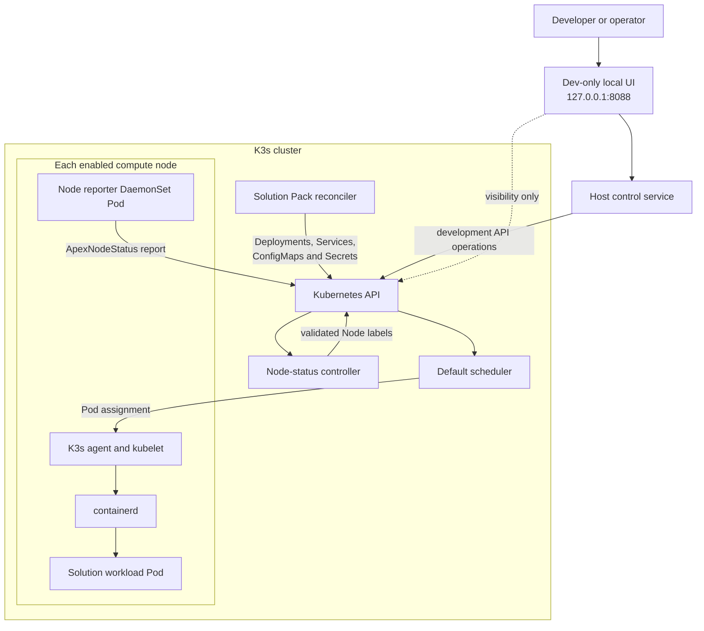
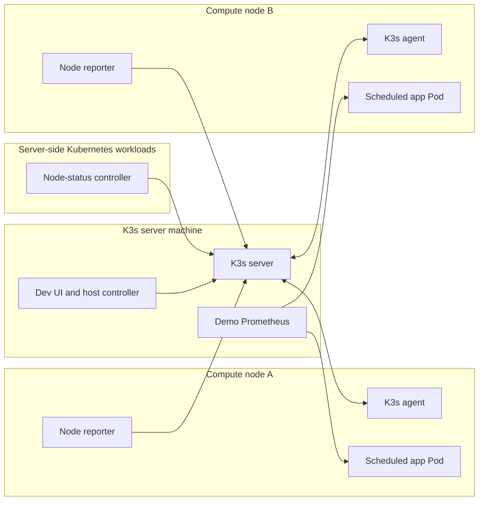
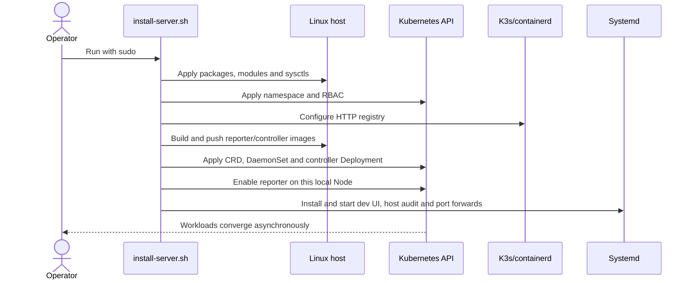
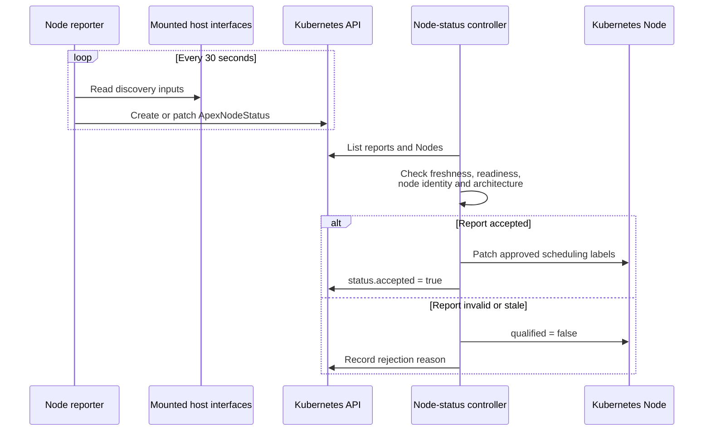
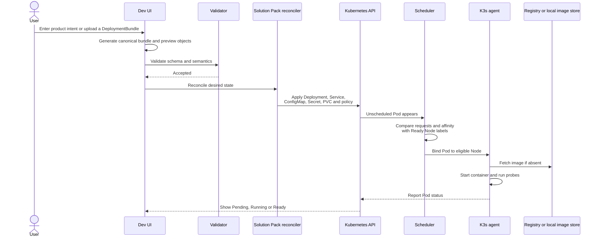
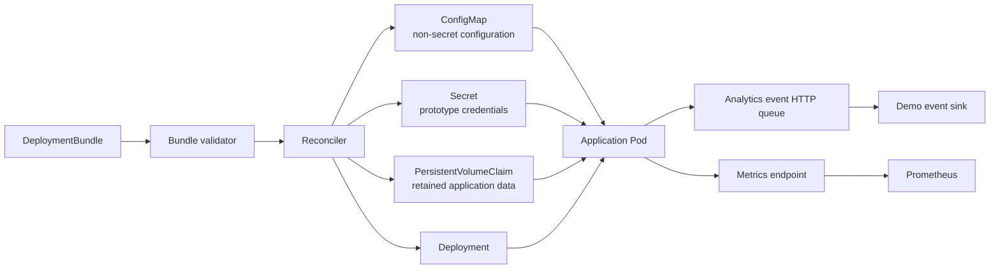
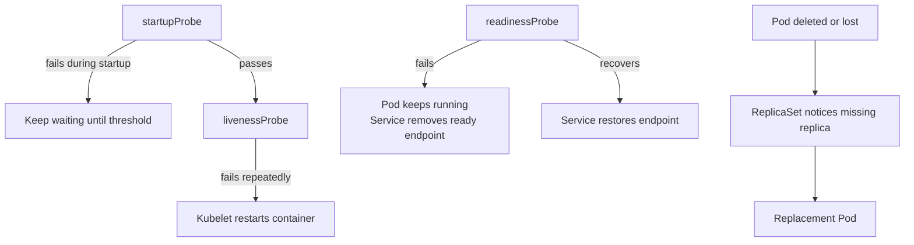
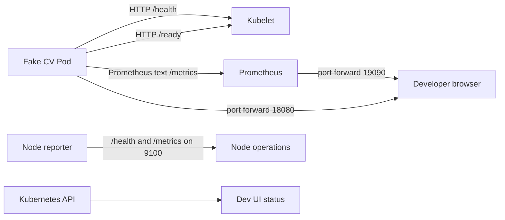
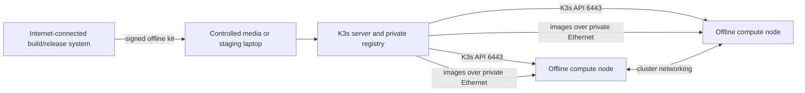

# ApexFabric prototype architecture

This guide explains the repository without assuming Kubernetes experience. It
starts with the basic vocabulary, follows a node and a Solution Pack through the
system, and ends with the current security and production boundaries.

## The short version

ApexFabric describes what should run and where it is allowed to run. Kubernetes
decides which eligible computer runs it, starts the containers, checks their
health, and replaces them after failures.

The repository separates four responsibilities:

1. A **node reporter** runs on each compute node and reports observations.
2. A **node-status controller** validates reports and owns scheduling labels.
3. A **Solution Pack reconciler** converts an accepted bundle into Kubernetes
   resources.
4. **Kubernetes/K3s** schedules and operates the resulting workloads.

The browser UI is a development tool layered over this flow. It is not part of
the intended production control plane.

Its demo stop/reset actions use an explicit resource allowlist. They scale or
recreate fake CV, the event receiver and demo Prometheus only; they do not stop
K3s, node reporters, the node-status controller or unrelated workloads.

## Kubernetes vocabulary used here

| Term | Plain-language meaning |
|---|---|
| Cluster | All server and compute machines managed as one system |
| K3s server | Runs the Kubernetes API and scheduler; stores cluster desired state |
| K3s agent | Runs on a compute machine and starts containers assigned to that machine |
| Node | Kubernetes's record for one server or compute machine |
| Container image | Packaged application filesystem and startup command |
| Pod | One scheduled instance of one or more containers |
| Deployment | Desired replica count and update strategy for Pods |
| ReplicaSet | Deployment-owned controller that maintains one Pod template revision |
| Service | Stable network name that routes only to eligible, Ready Pods |
| Probe | HTTP check used by kubelet to determine startup, readiness or liveness |
| Label | Key/value metadata used by the scheduler, such as architecture or camera access |
| Affinity | Rules saying which labelled nodes a Pod may use |
| DaemonSet | Ensures one Pod runs on every matching node |
| CRD | A custom Kubernetes record type supplied by ApexFabric |
| Controller | A loop that observes current state and moves it toward desired state |
| Reconcile | Compare desired and actual state, then apply only required changes |

K3s is a compact Kubernetes distribution. The Kubernetes behaviors discussed
in this repository—Deployments, Services, probes, scheduling and RBAC—are not
K3s-specific concepts.

## System overview



The arrows matter:

- The reporter does **not** label nodes or deploy applications.
- The node-status controller does **not** deploy Solution Packs.
- The reconciler does **not** select a concrete node.
- The scheduler does **not** decide desired application configuration.

## What runs where



On the development laptop, the K3s server and one compute node are the same
physical machine. Keeping the logical roles separate makes the same model
extend to additional compute boxes later.

Server-only management workloads select `apexfabric.com/control-plane=true`.
The installer applies that label to the local server by matching its machine
ID, preventing a controller whose image exists only on the server from being
scheduled onto an agent.

An additional compute box runs `k3s-agent` only. It must not simultaneously run
`k3s server`; both roles attempt to own the local agent load-balancer port
`6444`. The supported mixed cluster uses multi-architecture images pushed to
the laptop's private Docker Registry and pulled by Intel 285H and Jetson Orin
workers.

## Installation and startup

The supported `scripts/install-server.sh` wrapper establishes the stable server
identity, invokes the K3s and platform installers, and publishes the
multi-architecture management/demo images. `install-agent.sh` provisions and
joins one worker at a time. The component scripts remain useful for repair and
development, but [CLEAN-INSTALL.md](CLEAN-INSTALL.md) is the installation
runbook.



The install is split this way because host provisioning needs root access,
while normal cluster reconciliation should happen through narrowly scoped
Kubernetes service accounts.

## Node discovery and labelling

The reporter creates an `ApexNodeStatus` custom resource. It contains observed
CPU architecture, memory, storage, network, decoder, accelerator and configured
camera information. It does not claim scheduling authority.

The reporter also reasserts the qualified static
`apexfabric.com/camera-streams` extended resource for nodes carrying a supported
`apexfabric.com/hardware-profile` label. This capacity comes from the shared
hardware-profile configuration rather than runtime benchmarking or camera
discovery.



Examples of controller-owned labels are:

```text
apexfabric.com/qualified=true
apexfabric.com/node-class=cv
apexfabric.com/architecture=amd64
apexfabric.com/decoder=vaapi
apexfabric.com/metis=false
```

This separation prevents a node process from declaring itself qualified. The
current prototype still needs admission controls and stronger per-node identity
before this trust boundary is production-grade.

## Solution Pack deployment and scheduling

A DeploymentBundle says what applications should exist, their images,
configuration, probes, resource requests, required cameras and placement
characteristics. It does not name a specific compute node.



If no node satisfies resources or affinity, the Pod remains `Pending` and the
scheduler records a reason. It is safer to leave a workload visibly Pending
than to run it on unsupported hardware.

## Configuration and runtime data paths



The fake CV workload reads configuration from mounted files and Secret-backed
environment variables. Production must replace plaintext bundle secret values
with references to a proper secret-management workflow.

## Health and failure recovery

Kubernetes uses three distinct probe meanings:



The repository exercises these behaviors against real K3s in
`scripts/test-k8s-lifecycle.sh`. See `FAILURE-RECOVERY.md` for exact assertions
and captured evidence.

## Monitoring path



The current Prometheus manifest directly scrapes the fake CV workload and uses
ephemeral storage. Reporter metric discovery, durable monitoring, alert rules
and long-term retention remain production work.

## Offline compute nodes

Compute nodes do not require Wi-Fi or internet. They require a private network
path to the K3s server and a way to obtain signed binaries and container images.



The current `build-node-management.sh` publishes development management images
to the laptop registry for compute nodes. Protected product-image ingestion is
not automated yet. A production offline
installer must distribute signed, verified OCI archives and securely deliver an expiring K3s join
credential and the architecture-matching K3s air-gap bundle.

The demo manifest also supplies one shared camera ConfigMap to reporters. A
production multi-node system needs authenticated per-node camera reachability
configuration and active connectivity checks; it must not assume every node can
reach the same cameras.

## Permissions and trust boundaries

| Component | Allowed responsibility | Must not do |
|---|---|---|
| Node reporter | Create/update capability reports | Label Nodes, deploy apps, read application Secrets |
| Node-status controller | Read reports/Nodes, update report status and approved Node labels | Deploy Solution Packs |
| Solution Pack reconciler | Manage owned namespace application resources | Select `nodeName`, modify arbitrary Nodes |
| Workload Pod | Read its own mounted configuration/Secret and serve its ports | Access Kubernetes API or host filesystem |
| Dev UI/controller | Development orchestration and visibility | Be exposed as a production unauthenticated service |

The manifests implement these as separate service accounts and RBAC roles. The
remaining production gaps include per-node report authorization, admission
policy, signed images, image digests, controller leader election, audit
hardening, TLS/user authentication and secret-store integration.

## Where to read next

- `README.md`: install commands, repository map and production boundary.
- `PLATFORM.md`: operational behavior and V1 goal coverage.
- `FAILURE-RECOVERY.md`: reproducible Kubernetes failure tests.
- `UPGRADE-MODEL.md`: external configuration, rolling upgrade and data-lifecycle boundary.
- `deploy/k8s/apexfabric-node-management.yaml`: CRD, DaemonSet, controller and RBAC.
- `solution-packs/schema/deployment-bundle.schema.json`: accepted Solution Pack structure.
