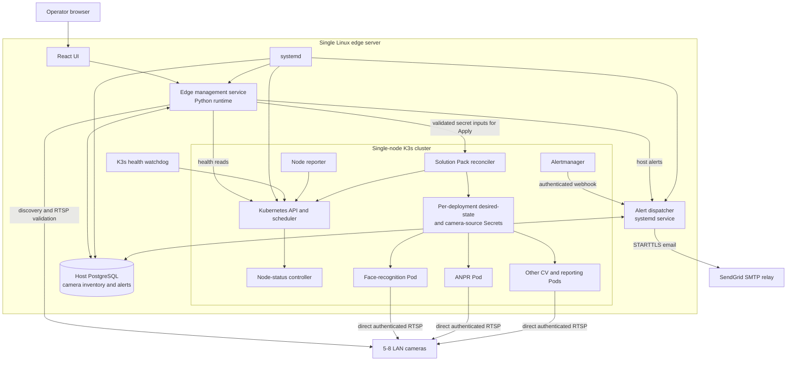
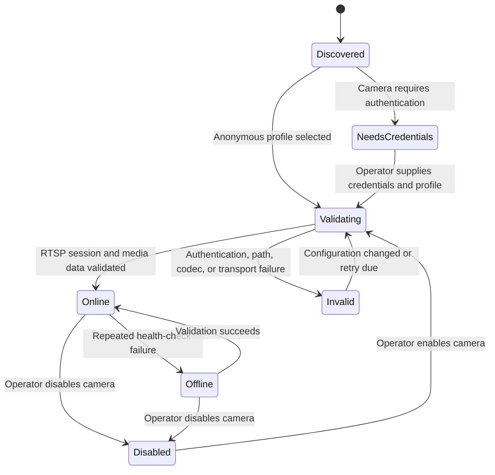
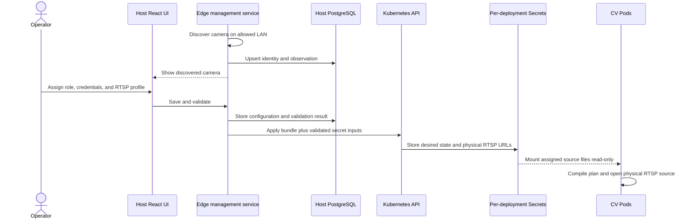
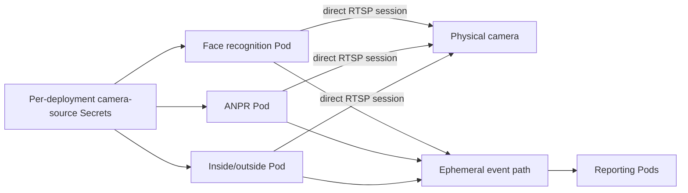

# TVT single-server video analytics: high-level design

## 1. Purpose

This document describes a single physical edge server that discovers and reads
RTSP streams from five to eight LAN-connected cameras. The server runs a
single-node K3s cluster. All stream ingestion and computer-vision (CV)
processing runs in K3s Pods.

Different CV use cases run in separate Pods and may consume the same camera
stream concurrently. The initial use cases from `README.md` are:

- face recognition;
- face enrollment;
- automatic number plate recognition (ANPR);
- inside/outside duration and attendance reporting;
- daily vehicle entry and exit reporting; and
- automated daily reports by email.

A small host management plane remains available when K3s is unavailable. It
discovers cameras, validates RTSP connectivity, records camera inventory in
PostgreSQL, reports host and K3s health, serves the React management UI, and
delivers durable operational alert email through a separate host dispatcher.

This design extends the node reporting, Solution Pack reconciliation,
scheduling, probe, and failure-recovery model described in
`APEXFABRIC_ARCHITECTURE.md`. It does not move CV inference out of the cluster.

## 2. Scope and assumptions

### 2.1 In scope

- One Linux server acting as both the K3s server and its only compute node.
- Five to eight IP cameras on a LAN reachable from the server.
- Discovery of previously unknown cameras.
- Persistent inventory of discovered cameras in a host PostgreSQL database.
- Operator entry of camera credentials and selection of an RTSP profile/path.
- Authenticated RTSP validation and continuous camera-health reporting.
- A host-served React UI that remains available during a K3s outage.
- Direct authenticated RTSP consumption by each assigned CV workload.
- Per-deployment camera-source Secrets following the reference Solution Pack
  contract.
- Automatic recovery from process, Pod, and ordinary K3s service failures
  within a few minutes.
- Alerts displayed in the local UI.
- Durable, auditable firing, reminder, and recovery email for configured
  operational alerts.
- On-site access to the management UI from a dedicated management network.

### 2.2 Out of scope for this version

- Control-plane or server high availability.
- Automatic configuration of server NICs, VLANs, routes, switches, or cameras.
- SMS, paging, and arbitrary cloud notification channels other than the
  approved SMTP relay.
- Detection of a total server, power, or site-network outage from outside the
  box.
- Durable retention of video, snapshots, CV events, attendance data, or
  generated reports.
- Final camera sizing, GPU sizing, codec selection, resolution, or frame-rate
  guarantees.

Camera inventory is operational configuration and is persisted in PostgreSQL.
The statement that CV data need not survive locally does not apply to that
inventory. Face enrollment and daily reporting will eventually require a
defined durable data store. Face enrollment, recognition, ANPR, attendance,
vehicle history, and business-reporting components are therefore integration
stubs until application images and a durable business-data design are supplied;
their records are not required to survive restart in V1. Operational alert and
email-delivery records are management-plane data and remain durable.

## 3. Architecture decisions

### 3.1 Keep an independent host management service

A separate host process is required because the camera and outage UI must work
when the Kubernetes API or all cluster workloads are unavailable. Python is an
implementation choice, not a reliability requirement. A packaged Python
virtual environment managed by `systemd` is suitable for the first version.

The service is called the **edge management service** in this document. It:

- serves the compiled React application and a management API;
- discovers cameras only on explicitly configured LAN subnets;
- stores camera identity, configuration, and last-known status in PostgreSQL;
- validates camera RTSP access;
- observes host, PostgreSQL, K3s API, Node, and workload health;
- synchronizes approved camera configuration into K3s using narrowly scoped
  credentials; and
- records and displays local alerts and recovery actions.

It does not run inference, act as a general-purpose root daemon, or continuously
restart K3s. `systemd` remains responsible for ordinary process lifecycle.

### 3.2 Keep PostgreSQL outside K3s

PostgreSQL runs as a host `systemd` service and listens only on a Unix socket or
loopback interface. Keeping it outside the cluster allows camera inventory and
the management UI to remain useful while K3s is down.

This PostgreSQL instance stores management-plane data only. It is not the
application database for recognition, attendance, ANPR, or report history.

### 3.3 Let Solution Pack workloads read cameras directly

TVT uses the camera-input contract already implemented by `k3s-prototype`.
For every deployed solution, the management plane creates the installation-
owned desired-state and camera-source Secrets expected by its
`DeploymentBundle`. Each assigned camera URL is mounted read-only at
`/run/secrets/apexfabric/<camera_id>.rtsp`; the init container and CV runtime
read the source through the existing `file:` desired-state reference.

Each CV workload therefore establishes and owns its physical RTSP session,
decode, reconnect policy, readiness, and per-camera telemetry. If several
independent workloads use the same camera, the camera receives several RTSP
sessions and the credential-bearing URL exists in each deployment's camera-
source Secret. Camera connection limits and aggregate LAN traffic must be
verified during field acceptance. There is no GStreamer, MediaMTX, internal
restreaming Service, or one-upstream-session guarantee in V1.

Because the reference renderer mounts individual Secret keys with Kubernetes
`subPath`, changing an address, path, or password requires updating every
affected deployment Secret and restarting the corresponding Deployment. The
host database remains the authoritative credential store and records pending
and applied synchronization per deployment.

### 3.4 Separate discovery from scheduling authority

The host service reports observed cameras and synchronizes only camera-source
configuration. It does not label Kubernetes Nodes or directly choose a Node
for a workload. The existing node-status controller retains ownership of
scheduling labels, and the Solution Pack reconciler retains ownership of CV
Deployments and Services.

The `solution-packs/` tree, DeploymentBundle schema, semantic validator,
camera-locality logic, renderer, field manager, labels, Namespace rendering,
server-side apply, pruning, retained-PVC behavior, and their tests are copied
from the approved `k3s-prototype` baseline without TVT-specific forks. TVT adds
camera discovery and supplies validated secret inputs to that existing Apply
workflow; it does not introduce a second bundle format or renderer.

### 3.5 Keep alert delivery outside K3s

A separate host `tvt-alert-dispatcher.service` receives authenticated firing
and resolved Alertmanager webhooks and fixed host-originated alerts. In one
PostgreSQL transaction it records the alert transition, evaluates the site
notification policy, and creates an email outbox item. A worker claims due
items and delivers them through SendGrid's SMTP relay using certificate-
verified STARTTLS.

The dispatcher owns delivery retry, acknowledgement-aware reminders, recovery
email, and redacted delivery history. Alertmanager continues to own PromQL
evaluation, grouping, inhibition, and initial notification timing. A bounded
filesystem emergency spool is used only for allowlisted host-infrastructure
alerts when PostgreSQL is unavailable. The dispatcher is not used for daily
business reports.

### 3.6 Restrict and authenticate the on-site management UI

The UI binds only to the approved on-site management interface and is blocked
from camera, public-WAN, and general production-user networks. V1 uses an
installer-created local administrator account, an Argon2id password hash,
forced password replacement at first login, server-side sessions with Secure,
HttpOnly, and SameSite cookies, CSRF protection on mutations, login throttling,
and TLS using the site's certificate or installer-managed local CA. V1 has one
administrator role; additional roles or identity-provider integration require
a later access-control design.

## 4. System context



The React UI is built as static assets and served by the edge management
service. It must not depend on an in-cluster ingress controller, Service, DNS,
or database.

## 5. Component responsibilities

| Component | Runs where | Responsibilities | Explicitly not responsible for |
|---|---|---|---|
| React UI | Host management plane | Camera onboarding, live status, K3s status, alert acknowledgement and delivery status | Inference or direct Kubernetes access |
| Edge management service | Host `systemd` service | Discovery, inventory, RTSP validation, UI API, health aggregation, camera-config sync | CV processing, Node labels, unrestricted cluster administration |
| Alert dispatcher | Host `systemd` service | Authenticated alert ingestion, durable outbox, acknowledgement-aware reminders, recovery email, SMTP retry and delivery audit | PromQL evaluation, business-report email, arbitrary templates or recipients from alert payloads |
| Management PostgreSQL | Host `systemd` service | Camera records, status history, operational alerts, notification outbox and audit metadata | CV event, video, attendance, ANPR, or business-report retention |
| K3s health watchdog | Host `systemd` timer/service | Detect sustained API failure and perform bounded recovery | General cluster orchestration |
| Node reporter | K3s DaemonSet Pod | Report host capabilities through `ApexNodeStatus` | Active camera discovery or Node labelling |
| Node-status controller | K3s | Validate reports and own scheduling labels | Camera inventory or Solution Pack deployment |
| Solution Pack reconciler | K3s | Materialize the reference DeploymentBundle as Namespace, Deployments, Services, configuration, Secrets, PVCs, policies and probes | Selecting a concrete Node |
| CV use-case Pods | K3s | Read assigned RTSP URLs from mounted Secrets, connect directly to cameras, decode, reconnect and emit results/metrics | Camera discovery, credential ownership or Kubernetes reconciliation |

A Solution Pack may contain one CV use case or a compatible group of use
cases. Separate Solution Packs or Deployments remain isolated even when they
consume the same physical camera. Each such consumer creates its own camera
session.

## 6. Camera discovery and onboarding

### 6.1 Discovery boundary

Discovery is restricted to an operator-configured allowlist of local IPv4/IPv6
subnets and interfaces. The service never scans arbitrary routes or the
internet.

The installer enumerates the server NICs and their directly connected subnets
and requires the installer to select the camera-facing interface and subnet.
For example, an on-site server might select `enp2s0` and
`192.168.20.0/24`; these are deployment values, not hard-coded defaults. This
selection answers two security and safety questions: where WS-Discovery is
sent, and which addresses may receive bounded TCP probes. An explicit
allowlist prevents the service from scanning the management LAN, customer
office network, public routes, or another VLAN by accident.

Discovery uses the following methods in order:

1. ONVIF WS-Discovery on the selected LAN interface, where supported.
2. Existing neighbor/ARP information to identify active LAN hosts.
3. Rate-limited TCP probes on configured camera ports, such as RTSP 554/8554
   and HTTP/HTTPS management ports.
4. Optional ONVIF device-information queries after credentials are available.

ICMP reachability is only a hint because cameras may block ping. A camera is
not considered usable until the RTSP stream itself is validated.

### 6.2 Identity and deduplication

The database assigns an internal immutable `camera_id`. Observations are
deduplicated using the strongest available identity in this order:

1. ONVIF endpoint UUID or device identifier;
2. normalized hardware/MAC address on the local LAN; and
3. IP address plus vendor/model evidence as a temporary identity.

An IP address is mutable metadata, not the primary camera identity. When DHCP
changes an address, the existing camera record is updated instead of creating
a duplicate where reliable identity evidence exists.

At minimum, a camera record contains:

- internal ID and discovery state;
- friendly name and physical role assigned by the operator;
- current and previous IP addresses;
- ONVIF identity, MAC address, vendor, and model when available;
- RTSP port, selected path/profile, and transport preference;
- credential reference, never a password returned to the browser;
- first-seen, last-seen, and last-successful-frame timestamps;
- validation result, failure category, and retry state; and
- enabled/disabled state for cluster synchronization.

### 6.3 Onboarding state machine



Discovery alone cannot prove that an authenticated RTSP stream is usable. For
an unknown protected camera, the UI must ask the operator for credentials and
either discover or select a media profile before validation can complete.

### 6.4 RTSP validation

Validation proceeds from least expensive to most expensive:

1. Resolve/reach the camera address and open the configured TCP port.
2. Perform RTSP `OPTIONS` and `DESCRIBE` with the configured credentials.
3. Set up the selected video track using the preferred transport.
4. Receive media packets and, when a compatible probe is available, decode at
   least one key frame.

Results distinguish network timeout, connection refusal, authentication
failure, missing stream path, unsupported codec, and media timeout. Checks use
jittered intervals, exponential backoff, and a concurrency limit so discovery
cannot overload the LAN or cameras.

The service detects and validates the existing network connection. It does not
assign camera addresses or modify host network configuration.

## 7. Camera configuration flow into K3s

Only cameras that are enabled and have passed RTSP validation are published to
the cluster.



The edge service invokes the same allowlisted Apply path as the reference
control plane. That workflow validates the bundle and ephemeral secret inputs,
creates the bundle-named desired-state and camera-source Secrets, and runs the
unchanged Solution Pack reconciler. Secret values never enter the stored
bundle, preview, job log, result, or audit record.

If K3s is unavailable, the database update succeeds locally and synchronization
is marked pending. Reconciliation is idempotently retried after the Kubernetes
API recovers. Per-deployment Secrets retain the last successfully applied
camera set during a temporary host-service outage.

Credentials are encrypted at rest using a host-held key, redacted from logs and
API responses, and copied only into camera-source Secrets for deployments
assigned that camera. Updating a source also triggers a controlled rollout
restart because the unchanged reference renderer uses `subPath` Secret mounts.
Credential-bearing RTSP URLs must never appear in bundles, ConfigMaps, Pod
environment, annotations, Events, API responses, logs, metrics, or alerts.

## 8. Direct stream and inference flow



Each application owns source readiness. It reports `source_unavailable` and
retries with bounded backoff rather than crash-looping during a camera outage.
One application's failure or reconnect must not interrupt another application,
although both are independently affected by the same camera or LAN failure.

The initial field benchmark uses all assigned CV consumers against up to eight
simultaneous 1080p, 15 FPS H.264 or H.265 sources at up to 4 Mbit/s per session.
It measures the actual number of direct sessions per camera, camera session
limits, aggregate camera-LAN bandwidth, reconnect time, packet loss, inference
latency, CPU, memory, hardware-decode utilization and thermals for eight hours.
The accepted assignment must stay within camera connection limits, reconnect
within 60 seconds after media becomes reachable, sustain packet loss below
0.1% on a healthy LAN, and avoid host thermal throttling. Adding another CV
consumer is a capacity change because it adds another physical RTSP session and
decode path.

## 9. Health, alerts, and UI behavior

### 9.1 Health model

The edge management service exposes independent status for:

- host uptime, disk space, memory pressure, temperature when available, and
  network-interface state;
- PostgreSQL connectivity;
- each camera's discovery, authentication, RTSP, and last-media status;
- `k3s.service` process state;
- Kubernetes API readiness;
- local Kubernetes Node readiness;
- per-deployment camera Secret synchronization; and
- CV Deployment desired/available replicas, Pod conditions, and direct-source
  media status.

These signals must not be collapsed into one red/green value. For example,
`k3s.service` can be active while its API is not ready, and a camera can answer
ONVIF while its RTSP stream fails authentication.

### 9.2 Durable operational alerts

Alerts are stored in the management database and shown in the React UI. Initial
alert conditions include:

- newly discovered camera awaiting configuration;
- known camera missing for a configurable interval;
- RTSP authentication or media validation failure;
- camera configuration waiting for K3s synchronization;
- K3s API unavailable or Node not Ready;
- CV source unavailable or repeatedly reconnecting;
- CV Deployment unavailable; and
- host disk, memory, or temperature threshold exceeded.

Alerts have `active`, `acknowledged`, and `resolved` states. Repeated failures
update one logical alert instead of creating an unbounded stream of duplicates.
Alertmanager sends firing and resolved events to the host dispatcher. The edge
service sends host/control-plane alerts to its permission-restricted Unix
socket, so K3s, Prometheus, and Alertmanager outages can still generate email.

Critical alerts normally require a two-minute sustained condition, send after
Alertmanager's 30-second grouping delay, and repeat every 30 minutes while
active and unacknowledged. Warnings normally require five to ten minutes, send
once after a five-minute grouping window, and repeat every four hours while
active and unacknowledged. Informational alerts remain UI-only by default.
Acknowledgement stops reminders but neither clears an alert nor suppresses a
recovery email. Recovery email is sent only when a firing email for that alert
occurrence was successfully delivered.

SendGrid is the default V1 SMTP relay. Its API key is stored in a root-readable
host credential file and is never stored in YAML, PostgreSQL, Kubernetes, or
logs. The initial non-delivering documentation identities are
`tvt-alerts@tvt.example` and `tvt-test-operator@tvt.example`; deployment must
replace them with a SendGrid-verified sender and a reachable test mailbox.
Recipient and sender values come only from site configuration, never from an
alert payload.

The dispatcher provides durable local queuing and audit, but cannot send while
the host, storage, site power, or outbound network is unavailable. Queued mail
resumes after connectivity returns. Detecting total-host failure still requires
a future external heartbeat.

## 10. Failure recovery

The target is automatic recovery within a few minutes for recoverable
process-level failures. This is not a promise of uninterrupted processing.

| Failure | Detection | Expected behavior and recovery |
|---|---|---|
| One CV process or Pod fails | Kubernetes probes and Deployment status | Kubelet restarts the container or the Deployment replaces the Pod |
| One workload RTSP session fails | Workload media timeout | That workload reconnects with bounded exponential backoff; other workloads continue independently |
| Camera becomes unreachable | Host validation and workload source telemetry | UI alert is raised; every assigned consumer exposes `source_unavailable`; automatic retry continues |
| Edge management service fails | `systemd` | Service restarts; K3s inference continues using last-applied configuration |
| PostgreSQL fails | `systemd` and edge-service check | PostgreSQL restarts; UI reports degraded management state; existing K3s inference continues |
| Alert dispatcher fails | `systemd` | Dispatcher restarts; Alertmanager retries uncommitted webhook delivery and committed outbox work resumes |
| SendGrid or site WAN is unavailable | SMTP result | Retain committed outbox items and retry with bounded backoff; show pending age in the UI |
| K3s process exits | `systemd` | K3s restarts automatically; Deployments reconcile after the API returns |
| K3s is active but API remains unhealthy | Host watchdog | After a sustained threshold, perform one controlled restart, then enter a cooldown and alert rather than restart-looping |
| Server reboots | `systemd` ordering | Network, PostgreSQL, edge service, and K3s start automatically; camera and workload reconciliation resumes |
| Power, disk, kernel, or complete host failure | Not reliably detectable on this box | All inference and the UI stop; operator or future external heartbeat is required |
| PostgreSQL inventory is lost or corrupt | Startup/database check | Manual restore or rediscovery; no HA replica exists in this version |

The K3s watchdog is a small root-owned `systemd` timer/service with a fixed
health-check and restart action. It is not arbitrary command execution exposed
through the Python API. A reasonable initial policy is:

1. Check local API readiness every 30 seconds.
2. Allow normal startup and transient failures for at least two minutes.
3. Restart K3s once after sustained failure.
4. Apply a ten-minute cooldown before another automatic restart.
5. Record every action for display in the UI.

Exact thresholds must be tuned using boot and recovery measurements. Before a
deployment is accepted, test Pod crash, camera disconnect/reconnect, K3s
restart, PostgreSQL restart, management-service restart, host reboot, and disk
pressure.

Initial measurable recovery targets are:

| Recovery event | V1 target |
|---|---|
| Camera media returns after a transient disconnect | Within 60 seconds |
| Failed container or ordinary Pod replacement | Within 2 minutes |
| CV source-session recovery after media returns | Within 60 seconds |
| PostgreSQL service recovery | Within 2 minutes |
| K3s API and workloads after a K3s service restart | Within 5 minutes |
| Management plane and workloads after a normal host reboot | Within 10 minutes |

Targets are measured from fault removal or restart initiation until the named
component is healthy; they do not include repair of hardware or network faults.

## 11. Availability statement

This is a **self-recovering single-server system**, not a highly available
system. Kubernetes improves workload recovery, but it cannot remove the only
physical server as a failure domain.

No numeric probability of total K3s outage is asserted without measured
failure and repair data. Availability should be calculated after field data is
available:

```text
availability = MTBF / (MTBF + MTTR)
```

The most important mitigations for this design are a UPS, graceful shutdown,
healthy storage, thermal monitoring, automatic service restart, tested
reinstallation/recovery media, and a documented replacement-server procedure.
Adding a second monitoring process on the same host improves diagnosis but does
not protect against total host failure. True K3s control-plane availability
would require additional physical server nodes and is outside this scope.

Camera inventory, alert/outbox/audit records, the local OCI registry, and
retained monitoring data must survive OS reinstallation through an encrypted
backup on operator-provided external USB storage or an approved network share.
Installation and upgrade procedures verify a backup before destructive work,
and a quarterly restore test validates the recovery procedure. CV stub data,
video, faces, plates, attendance, and generated business reports are not part
of this V1 backup set. The approved UPS must signal the OS and provide enough
runtime for an orderly PostgreSQL checkpoint and filesystem shutdown.

## 12. Security boundaries

- The management UI binds only to the on-site management interface, requires
  the local administrator authentication controls in section 3.6, and is not
  exposed on the public WAN or camera VLAN.
- Discovery is limited to configured interfaces and subnets and is rate
  limited.
- Camera credentials are write-only from the browser's perspective, encrypted
  at rest, excluded from logs, and never embedded in metrics.
- The edge service runs as an unprivileged user. Its Kubernetes credential is
  limited to camera synchronization and read-only health queries.
- The root-owned recovery watchdog accepts no user-supplied commands or
  arguments.
- CV Pods receive access only to the camera sources they require and do not
  receive Kubernetes API credentials or host filesystem access.
- PostgreSQL binds locally and uses a dedicated database role for the edge
  service.
- The dispatcher has its own service account and database role. Alertmanager's
  webhook credential and the SendGrid SMTP API key are separate, rotatable,
  protected host credentials.
- Alert email contains no RTSP URLs, camera credentials, faces, embeddings,
  people, number plates, Secret values, log bodies, or stack traces.
- Production images should be pinned by digest and supplied through the
  controlled image workflow described in `APEXFABRIC_ARCHITECTURE.md`.

## 13. Deployment and startup order

Host services are enabled at boot with these dependencies:

```text
network-online.target
  -> postgresql.service
  -> edge-management.service

network-online.target
  -> tvt-alert-dispatcher.service
     (ordered after the PostgreSQL startup attempt, but does not Require it)

network-online.target
  -> k3s.service
  -> k3s-health-watchdog.timer
```

The edge service and K3s are peers rather than a strict startup chain. The UI
must load when K3s is down, and K3s must run when the edge service is down.
Synchronization converges when both are available.

Within K3s, the node reporter and controllers establish Node eligibility;
the reference Solution Pack Apply workflow supplies assigned camera Secrets;
and CV Deployments start independently through the existing reconciler and
scheduler flow.

## 14. Frozen V1 implementation profile

- Reference baseline: `k3s-prototype` commit `bcb58030f89b`.
- Hardware/OS: Intel Core Ultra 9 285H-class server, 64 GiB RAM, 1 TiB NVMe,
  and Ubuntu 24.04 LTS.
- Runtime baseline: Python 3.12, PostgreSQL 16, and K3s
  `v1.36.3+k3s1`. Exact package builds, Helm chart versions, and image digests are
  frozen in the installer lock manifest rather than floated at install time.
- Camera integration: ONVIF WS-Discovery followed by bounded host RTSP probing;
  deployed CV applications connect directly to assigned physical sources.
- Management persistence: host PostgreSQL with versioned migrations;
  AES-256-GCM camera credential encryption using a protected, versioned host
  key.
- Camera-to-K3s contract: the unchanged reference `DeploymentBundle`, desired-
  state Secret, per-deployment camera-source Secret, `external_mounts`,
  `plan_compiler`, and `file:/run/secrets/apexfabric/<camera_id>.rtsp` image
  contract.
- UI: on-site management network only with the local administrator security
  controls in section 3.6. Tailscale and other off-site remote access are
  deferred.
- Alert transport: host dispatcher and SendGrid SMTP with durable PostgreSQL
  outbox and the bounded emergency path defined in `LLD_PLAN.md`.
- CV/business functions: non-durable integration stubs until images and data
  contracts are supplied.

## 15. Acceptance criteria

The first implementation of this design is accepted when it demonstrates that:

1. A new LAN camera appears in the host UI without K3s being required for
   discovery.
2. The operator can enter credentials, select a stream, and see a meaningful
   RTSP validation result.
3. A known camera remains associated with the same database record after an IP
   address change when stable identity data is available.
4. A generated reference-format Solution Pack mounts only its assigned camera
   URLs and its CV Pod opens those physical streams directly.
5. Two workloads assigned the same camera create two measured direct sessions,
   remain within the camera's connection limit, and reconnect independently.
6. A failed CV Pod is automatically restored.
7. Restarting K3s leaves the host UI and camera inventory available and restores
   cluster workloads within the measured few-minute recovery target.
8. Restarting the edge management service does not stop existing inference.
9. Camera passwords do not appear in browser responses, application logs,
   Kubernetes Events, or metrics.
10. A sustained synthetic alert produces one firing email and one recovery
    email through the approved SendGrid test configuration, with auditable
    delivery state and no sensitive data.
11. SMTP failure retains queued email across dispatcher restart and delivers it
    after connectivity returns without duplicating the logical transition.
12. A full host shutdown is clearly documented as undetectable until external
    monitoring is introduced.

## 16. References

- `README.md` for the requested TVT camera placement and CV use cases.
- `APEXFABRIC_ARCHITECTURE.md` for the ApexFabric node reporter, node-status
  controller, Solution Pack reconciler, K3s scheduling, probes, monitoring,
  and trust boundaries.
- [K3s architecture](https://docs.k3s.io/architecture) for single-server and
  high-availability topology.
- [K3s quick-start guide](https://docs.k3s.io/quick-start) for service startup
  and restart behavior.
- [Stopping K3s](https://docs.k3s.io/upgrades/killall) for the distinction
  between stopping the K3s service and stopping all K3s containers.
