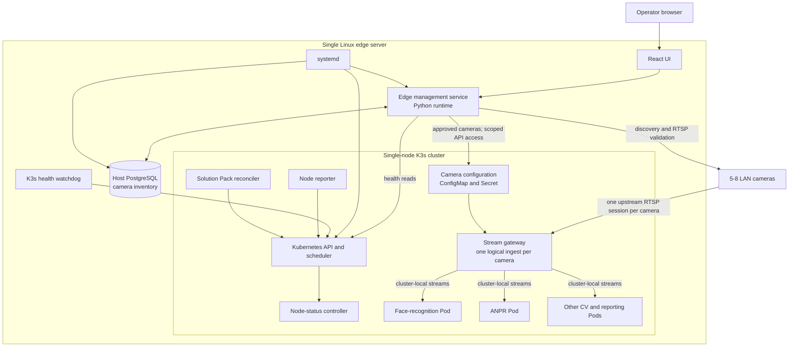
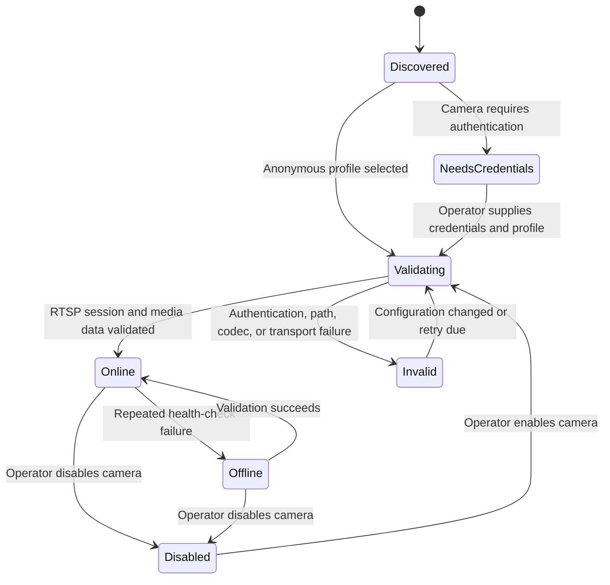
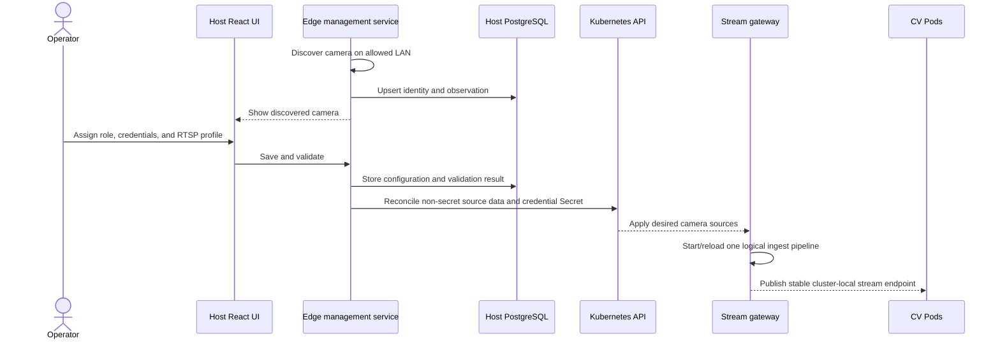
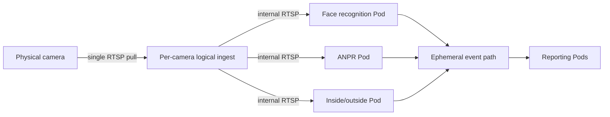

# TVT single-server video analytics: high-level design

## 1. Purpose

This document describes a single physical edge server that discovers and reads
RTSP streams from five to eight LAN-connected cameras. The server runs a
single-node K3s cluster. All stream ingestion and computer-vision (CV)
processing runs in K3s Pods.

Different CV use cases run in separate Pods and may consume the same camera
stream concurrently. The initial use cases from `README.md` are:

- face recognition;
- face enrollment;
- automatic number plate recognition (ANPR);
- inside/outside duration and attendance reporting;
- daily vehicle entry and exit reporting; and
- automated daily reports by email.

A small host management plane remains available when K3s is unavailable. It
discovers cameras, validates RTSP connectivity, records camera inventory in
PostgreSQL, reports host and K3s health, and serves the React management UI.

This design extends the node reporting, Solution Pack reconciliation,
scheduling, probe, and failure-recovery model described in
`ARCHITECTURE.md`. It does not move CV inference out of the cluster.

## 2. Scope and assumptions

### 2.1 In scope

- One Linux server acting as both the K3s server and its only compute node.
- Five to eight IP cameras on a LAN reachable from the server.
- Discovery of previously unknown cameras.
- Persistent inventory of discovered cameras in a host PostgreSQL database.
- Operator entry of camera credentials and selection of an RTSP profile/path.
- Authenticated RTSP validation and continuous camera-health reporting.
- A host-served React UI that remains available during a K3s outage.
- One logical stream-ingestion pipeline per enabled camera inside K3s.
- Fan-out of one camera stream to multiple, independently deployed CV Pods.
- Automatic recovery from process, Pod, and ordinary K3s service failures
  within a few minutes.
- Alerts displayed in the local UI.

### 2.2 Out of scope for this version

- Control-plane or server high availability.
- Automatic configuration of server NICs, VLANs, routes, switches, or cameras.
- Remote email, SMS, or cloud alert delivery.
- Detection of a total server, power, or site-network outage from outside the
  box.
- Durable retention of video, snapshots, CV events, attendance data, or
  generated reports.
- Final camera sizing, GPU sizing, codec selection, resolution, or frame-rate
  guarantees.

Camera inventory is operational configuration and is persisted in PostgreSQL.
The statement that CV data need not survive locally does not apply to that
inventory. Face enrollment and daily reporting will eventually require a
defined durable data store; until that is added, those use cases cannot offer
restart-safe history or enrollment records.

## 3. Architecture decisions

### 3.1 Keep an independent host management service

A separate host process is required because the camera and outage UI must work
when the Kubernetes API or all cluster workloads are unavailable. Python is an
implementation choice, not a reliability requirement. A packaged Python
virtual environment managed by `systemd` is suitable for the first version.

The service is called the **edge management service** in this document. It:

- serves the compiled React application and a management API;
- discovers cameras only on explicitly configured LAN subnets;
- stores camera identity, configuration, and last-known status in PostgreSQL;
- validates camera RTSP access;
- observes host, PostgreSQL, K3s API, Node, and workload health;
- synchronizes approved camera configuration into K3s using narrowly scoped
  credentials; and
- records and displays local alerts and recovery actions.

It does not run inference, act as a general-purpose root daemon, or continuously
restart K3s. `systemd` remains responsible for ordinary process lifecycle.

### 3.2 Keep PostgreSQL outside K3s

PostgreSQL runs as a host `systemd` service and listens only on a Unix socket or
loopback interface. Keeping it outside the cluster allows camera inventory and
the management UI to remain useful while K3s is down.

This PostgreSQL instance stores management-plane data only. It is not the
application database for recognition, attendance, ANPR, or report history.

### 3.3 Read each physical camera once

CV Pods must not connect independently to a physical camera. Multiple direct
connections increase camera load and LAN traffic and can exceed a camera's
client-session limit.

K3s therefore runs a **stream gateway** with one logical ingest pipeline for
each enabled camera. Each pipeline establishes the upstream RTSP session,
handles reconnects, timestamps stream-health observations, and exposes an
internal stream endpoint. Any number of authorized CV Pods can consume that
internal endpoint.

For the first version, the gateway may re-publish the compressed stream over
cluster-local RTSP. Each CV Pod then performs its own decode. Sharing decoded
frames across Pods is a future optimization that should be considered only
after measurements show decoding to be the bottleneck.

### 3.4 Separate discovery from scheduling authority

The host service reports observed cameras and synchronizes only camera-source
configuration. It does not label Kubernetes Nodes or directly choose a Node
for a workload. The existing node-status controller retains ownership of
scheduling labels, and the Solution Pack reconciler retains ownership of CV
Deployments and Services.

## 4. System context



The React UI is built as static assets and served by the edge management
service. It must not depend on an in-cluster ingress controller, Service, DNS,
or database.

## 5. Component responsibilities

| Component | Runs where | Responsibilities | Explicitly not responsible for |
|---|---|---|---|
| React UI | Host management plane | Camera onboarding, live status, K3s status, local alerts | Inference or direct Kubernetes access |
| Edge management service | Host `systemd` service | Discovery, inventory, RTSP validation, UI API, health aggregation, camera-config sync | CV processing, Node labels, unrestricted cluster administration |
| Management PostgreSQL | Host `systemd` service | Camera records, status history, local alerts, discovery metadata | CV event or video retention |
| K3s health watchdog | Host `systemd` timer/service | Detect sustained API failure and perform bounded recovery | General cluster orchestration |
| Node reporter | K3s DaemonSet Pod | Report host capabilities through `ApexNodeStatus` | Active camera discovery or Node labelling |
| Node-status controller | K3s | Validate reports and own scheduling labels | Camera inventory or Solution Pack deployment |
| Solution Pack reconciler | K3s | Materialize CV Deployments, Services, configuration, and probes | Selecting a concrete Node |
| Stream gateway | K3s | Maintain upstream RTSP sessions, reconnect, and fan out internal streams | CV inference or long-term recording |
| CV use-case Pods | K3s | Run one or more packaged CV functions and emit results/metrics | Connecting directly to physical cameras |

A Solution Pack may contain one CV use case or a compatible group of use
cases. Separate Solution Packs or Deployments remain isolated even when they
consume the same gateway stream.

## 6. Camera discovery and onboarding

### 6.1 Discovery boundary

Discovery is restricted to an operator-configured allowlist of local IPv4/IPv6
subnets and interfaces. The service never scans arbitrary routes or the
internet.

Discovery uses the following methods in order:

1. ONVIF WS-Discovery on the selected LAN interface, where supported.
2. Existing neighbor/ARP information to identify active LAN hosts.
3. Rate-limited TCP probes on configured camera ports, such as RTSP 554/8554
   and HTTP/HTTPS management ports.
4. Optional ONVIF device-information queries after credentials are available.

ICMP reachability is only a hint because cameras may block ping. A camera is
not considered usable until the RTSP stream itself is validated.

### 6.2 Identity and deduplication

The database assigns an internal immutable `camera_id`. Observations are
deduplicated using the strongest available identity in this order:

1. ONVIF endpoint UUID or device identifier;
2. normalized hardware/MAC address on the local LAN; and
3. IP address plus vendor/model evidence as a temporary identity.

An IP address is mutable metadata, not the primary camera identity. When DHCP
changes an address, the existing camera record is updated instead of creating
a duplicate where reliable identity evidence exists.

At minimum, a camera record contains:

- internal ID and discovery state;
- friendly name and physical role assigned by the operator;
- current and previous IP addresses;
- ONVIF identity, MAC address, vendor, and model when available;
- RTSP port, selected path/profile, and transport preference;
- credential reference, never a password returned to the browser;
- first-seen, last-seen, and last-successful-frame timestamps;
- validation result, failure category, and retry state; and
- enabled/disabled state for cluster synchronization.

### 6.3 Onboarding state machine



Discovery alone cannot prove that an authenticated RTSP stream is usable. For
an unknown protected camera, the UI must ask the operator for credentials and
either discover or select a media profile before validation can complete.

### 6.4 RTSP validation

Validation proceeds from least expensive to most expensive:

1. Resolve/reach the camera address and open the configured TCP port.
2. Perform RTSP `OPTIONS` and `DESCRIBE` with the configured credentials.
3. Set up the selected video track using the preferred transport.
4. Receive media packets and, when a compatible probe is available, decode at
   least one key frame.

Results distinguish network timeout, connection refusal, authentication
failure, missing stream path, unsupported codec, and media timeout. Checks use
jittered intervals, exponential backoff, and a concurrency limit so discovery
cannot overload the LAN or cameras.

The service detects and validates the existing network connection. It does not
assign camera addresses or modify host network configuration.

## 7. Camera configuration flow into K3s

Only cameras that are enabled and have passed RTSP validation are published to
the cluster.



The edge service uses a dedicated kubeconfig and least-privilege RBAC. It may
create or update only the named camera ConfigMap/Secret or a future
`CameraSource` custom resource in the product namespace. It cannot create
arbitrary workloads, label Nodes, or read unrelated Secrets.

If K3s is unavailable, the database update succeeds locally and synchronization
is marked pending. Reconciliation is idempotently retried after the Kubernetes
API recovers. Cluster-side configuration retains the last successfully applied
camera set during a temporary host-service outage.

Credentials are encrypted at rest using a host-held key, redacted from logs and
API responses, and placed in a Kubernetes Secret only when a camera is enabled.
RTSP URLs exposed to CV Pods must not contain inline passwords in logs or
metrics.

## 8. Stream and inference flow



The internal endpoint is stable for a `camera_id`; consumers do not use the
camera's mutable LAN address. Gateway readiness is false until upstream media
is flowing. Consumers report a distinct `source_unavailable` state rather than
crash-looping when their stream is temporarily offline.

The initial implementation may run one gateway Pod containing all logical
pipelines or one Pod per camera. One Pod per camera provides better failure and
restart isolation; a shared Deployment has lower overhead. This is an
implementation-time choice as long as the logical identity, one-upstream-pull
rule, health model, and consumer endpoint remain unchanged.

Because codec, resolution, FPS, model size, and accelerator information are not
yet known, support for eight streams is a design target rather than a capacity
guarantee. A deployment benchmark must later verify decode sessions, GPU/CPU
utilization, memory, thermals, end-to-end latency, and reconnect behavior with
all intended use cases active.

## 9. Health, alerts, and UI behavior

### 9.1 Health model

The edge management service exposes independent status for:

- host uptime, disk space, memory pressure, temperature when available, and
  network-interface state;
- PostgreSQL connectivity;
- each camera's discovery, authentication, RTSP, and last-media status;
- `k3s.service` process state;
- Kubernetes API readiness;
- local Kubernetes Node readiness;
- stream-gateway desired/ready state and per-camera media flow; and
- CV Deployment desired/available replicas and Pod conditions.

These signals must not be collapsed into one red/green value. For example,
`k3s.service` can be active while its API is not ready, and a camera can answer
ONVIF while its RTSP stream fails authentication.

### 9.2 Local alerts

Alerts are stored in the management database and shown in the React UI. Initial
alert conditions include:

- newly discovered camera awaiting configuration;
- known camera missing for a configurable interval;
- RTSP authentication or media validation failure;
- camera configuration waiting for K3s synchronization;
- K3s API unavailable or Node not Ready;
- stream gateway unavailable or repeatedly reconnecting;
- CV Deployment unavailable; and
- host disk, memory, or temperature threshold exceeded.

Alerts have `active`, `acknowledged`, and `cleared` states. Repeated failures
update one alert instead of creating an unbounded stream of duplicates.

Because alerting is local-only, no alert can be delivered when the operator is
not viewing the UI, the host is powered off, or its LAN connection is lost.
This is an accepted limitation of this version.

### 9.3 Future external observability

The next operational increment should export structured metrics, logs, traces,
and bounded diagnostic snapshots to a central dashboard. Remote shell access
through a secure support tunnel should be a last-resort diagnostic mechanism,
not the primary monitoring path. This extension can add off-box alert delivery
and total-host heartbeat detection without changing the camera-ingest or CV
workload boundaries in this design. It is not required for the current
UI-only-alert phase.

## 10. Failure recovery

The target is automatic recovery within a few minutes for recoverable
process-level failures. This is not a promise of uninterrupted processing.

| Failure | Detection | Expected behavior and recovery |
|---|---|---|
| One CV process or Pod fails | Kubernetes probes and Deployment status | Kubelet restarts the container or the Deployment replaces the Pod |
| One upstream RTSP session fails | Gateway media timeout | Gateway reconnects with bounded exponential backoff; other camera pipelines continue |
| Camera becomes unreachable | Host validation and gateway health | UI alert is raised; consumers expose `source_unavailable`; automatic retry continues |
| Edge management service fails | `systemd` | Service restarts; K3s inference continues using last-applied configuration |
| PostgreSQL fails | `systemd` and edge-service check | PostgreSQL restarts; UI reports degraded management state; existing K3s inference continues |
| K3s process exits | `systemd` | K3s restarts automatically; Deployments reconcile after the API returns |
| K3s is active but API remains unhealthy | Host watchdog | After a sustained threshold, perform one controlled restart, then enter a cooldown and alert rather than restart-looping |
| Server reboots | `systemd` ordering | Network, PostgreSQL, edge service, and K3s start automatically; camera and workload reconciliation resumes |
| Power, disk, kernel, or complete host failure | Not reliably detectable on this box | All inference and the UI stop; operator or future external heartbeat is required |
| PostgreSQL inventory is lost or corrupt | Startup/database check | Manual restore or rediscovery; no HA replica exists in this version |

The K3s watchdog is a small root-owned `systemd` timer/service with a fixed
health-check and restart action. It is not arbitrary command execution exposed
through the Python API. A reasonable initial policy is:

1. Check local API readiness every 30 seconds.
2. Allow normal startup and transient failures for at least two minutes.
3. Restart K3s once after sustained failure.
4. Apply a ten-minute cooldown before another automatic restart.
5. Record every action for display in the UI.

Exact thresholds must be tuned using boot and recovery measurements. Before a
deployment is accepted, test Pod crash, camera disconnect/reconnect, K3s
restart, PostgreSQL restart, management-service restart, host reboot, and disk
pressure.

## 11. Availability statement

This is a **self-recovering single-server system**, not a highly available
system. Kubernetes improves workload recovery, but it cannot remove the only
physical server as a failure domain.

No numeric probability of total K3s outage is asserted without measured
failure and repair data. Availability should be calculated after field data is
available:

```text
availability = MTBF / (MTBF + MTTR)
```

The most important mitigations for this design are a UPS, graceful shutdown,
healthy storage, thermal monitoring, automatic service restart, tested
reinstallation/recovery media, and a documented replacement-server procedure.
Adding a second monitoring process on the same host improves diagnosis but does
not protect against total host failure. True K3s control-plane availability
would require additional physical server nodes and is outside this scope.

## 12. Security boundaries

- The management UI must require authentication before it is exposed beyond
  loopback or a dedicated management network.
- Discovery is limited to configured interfaces and subnets and is rate
  limited.
- Camera credentials are write-only from the browser's perspective, encrypted
  at rest, excluded from logs, and never embedded in metrics.
- The edge service runs as an unprivileged user. Its Kubernetes credential is
  limited to camera synchronization and read-only health queries.
- The root-owned recovery watchdog accepts no user-supplied commands or
  arguments.
- CV Pods receive access only to the camera sources they require and do not
  receive Kubernetes API credentials or host filesystem access.
- PostgreSQL binds locally and uses a dedicated database role for the edge
  service.
- Production images should be pinned by digest and supplied through the
  controlled image workflow described in `ARCHITECTURE.md`.

## 13. Deployment and startup order

Host services are enabled at boot with these dependencies:

```text
network-online.target
  -> postgresql.service
  -> edge-management.service

network-online.target
  -> k3s.service
  -> k3s-health-watchdog.timer
```

The edge service and K3s are peers rather than a strict startup chain. The UI
must load when K3s is down, and K3s must run when the edge service is down.
Synchronization converges when both are available.

Within K3s, the node reporter and controllers establish Node eligibility;
camera synchronization supplies enabled sources; the stream gateway becomes
Ready when media flows; and CV Deployments start independently through the
existing Solution Pack and scheduler flow.

## 14. Open implementation choices

These choices do not block the high-level architecture but must be resolved
before implementation:

- stream-gateway product/library and internal transport;
- one gateway Pod per camera versus multiple logical pipelines per Pod;
- ONVIF and RTSP client libraries;
- PostgreSQL schema and credential-encryption mechanism;
- exact React UI authentication and network exposure;
- camera configuration resource shape (ConfigMap/Secret versus a dedicated
  `CameraSource` CRD);
- health and recovery thresholds; and
- hardware capacity after camera and accelerator specifications are known.

## 15. Acceptance criteria

The first implementation of this design is accepted when it demonstrates that:

1. A new LAN camera appears in the host UI without K3s being required for
   discovery.
2. The operator can enter credentials, select a stream, and see a meaningful
   RTSP validation result.
3. A known camera remains associated with the same database record after an IP
   address change when stable identity data is available.
4. One physical RTSP session is fanned out to at least two different CV Pods.
5. Disconnecting one camera does not interrupt other camera pipelines.
6. A failed CV Pod is automatically restored.
7. Restarting K3s leaves the host UI and camera inventory available and restores
   cluster workloads within the measured few-minute recovery target.
8. Restarting the edge management service does not stop existing inference.
9. Camera passwords do not appear in browser responses, application logs,
   Kubernetes Events, or metrics.
10. A full host shutdown is clearly documented as an undetectable local-only
    failure until external monitoring is introduced.

## 16. References

- `README.md` for the requested TVT camera placement and CV use cases.
- `ARCHITECTURE.md` for the ApexFabric node reporter, node-status controller,
  Solution Pack reconciler, K3s scheduling, probes, monitoring, and trust
  boundaries.
- [K3s architecture](https://docs.k3s.io/architecture) for single-server and
  high-availability topology.
- [K3s quick-start guide](https://docs.k3s.io/quick-start) for service startup
  and restart behavior.
- [Stopping K3s](https://docs.k3s.io/upgrades/killall) for the distinction
  between stopping the K3s service and stopping all K3s containers.
