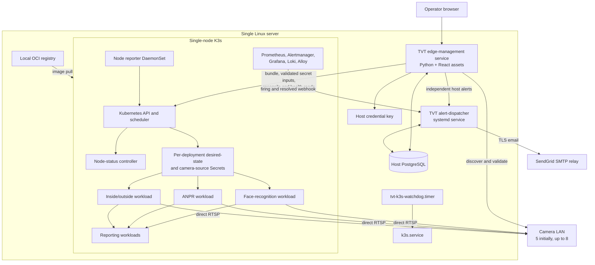
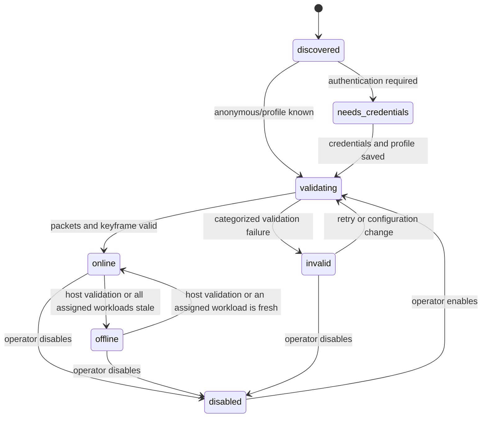
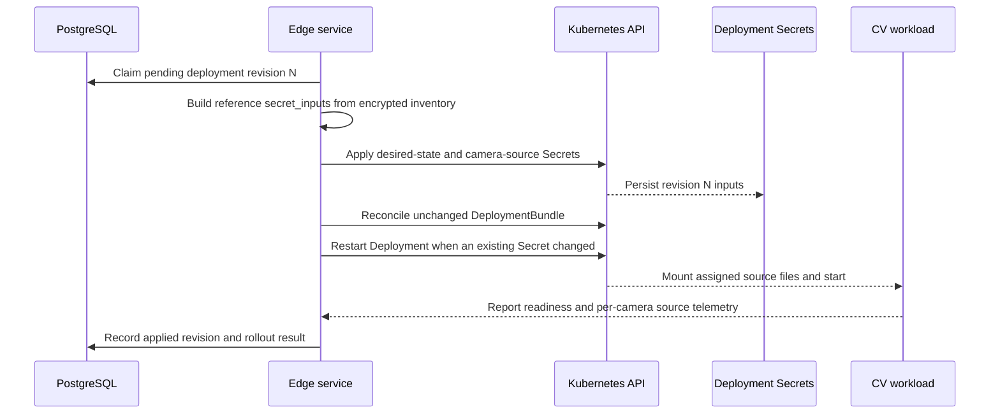
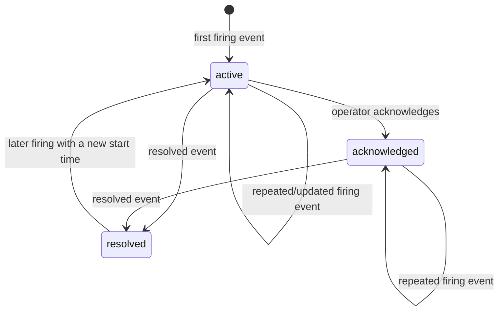

# TVT prototype: sample low-level design plan

**Status:** Design updated; implementation pending
**Scope:** Single physical server, single-node K3s, five initially installed cameras with a design ceiling of eight  
**Reference implementation:** `../k3s-prototype`  
**Related TVT documents:** `README.md`, `HLD.md`, `MONITORING.md`, `APEXFABRIC_ARCHITECTURE.md`

## 1. Review summary

This plan keeps the working K3s-plane boundaries from `k3s-prototype` and adds
a TVT-specific host camera-management plane.

The K3s plane retains:

- the `ApexNodeStatus` capability-reporting contract;
- controller-owned node qualification and scheduling labels;
- schema and semantic validation of `DeploymentBundle`;
- deterministic bundle revision hashing and Kubernetes object rendering;
- server-side apply, ownership labels, pruning, and retained PVC behavior;
- Kubernetes scheduling through resource requests and required node affinity;
- startup, readiness, and liveness probes;
- declarative stop/start, rollout, and explicit rollback behavior; and
- digest-pinned images delivered through a local registry.

The TVT-specific addition is a host-managed Python service which discovers
camera candidates, validates RTSP media, persists camera inventory in
PostgreSQL, serves the management API/UI, and synchronizes enabled camera
configuration into K3s.

V1 includes the approved host alert-dispatcher service for durable alert
email. `HLD.md` and `MONITORING.md` define the matching SendGrid SMTP,
outbox, retry, acknowledgement, and recovery-email contracts.

This plan deliberately excludes:

- discovery, connection establishment, enrollment, approval, rejection, or
  revocation of remote node agents;
- controller-to-node K3s installation or token delivery;
- controller-side driver bundle construction;
- node-side offline driver download, installation, reboot, and progress RPCs;
- multi-server K3s control-plane high availability; and
- automatic network, VLAN, switch, or camera configuration.

The phrase "discover cameras by reading RTSP streams" is interpreted as two
separate operations:

1. discover candidate devices using ONVIF WS-Discovery and bounded LAN probes;
2. identify a device as a usable camera only after the Python runtime opens and
   reads its RTSP media.

RTSP alone cannot reliably discover an unknown device when its address, stream
path, or credentials are not known.

## 2. Proposed decisions

| Area | Proposed V1 decision | Reason |
|---|---|---|
| Topology | One Ubuntu server runs the K3s server and worker | Matches the TVT deployment and removes remote-node enrollment |
| Product namespace | Retain `apexfabric` for the first implementation; use `monitoring` for observability | Maximizes reuse of manifests, labels, tests, and renderer defaults |
| Host runtime | Python 3.12, one `systemd`-managed process with an asyncio scheduler and one API worker | Simple ownership and no duplicate background jobs |
| Host API | FastAPI served by Uvicorn; compiled React assets served by the same process | Provides typed APIs while keeping the UI alive when K3s is down |
| Database | Host PostgreSQL with SQLAlchemy and Alembic | Camera inventory must remain usable during a K3s outage |
| Camera discovery | ONVIF WS-Discovery first, neighbor-table candidates second, rate-limited TCP probes last | Avoids blind full-network scans where possible |
| RTSP validation | PyAV/FFmpeg in killable child processes with hard deadlines | Verifies packets/keyframes while containing native-library hangs |
| Credential storage | AES-256-GCM ciphertext in PostgreSQL; versioned key stored as a protected host file | Keeps browser/API/database views free of plaintext credentials |
| Camera-to-K3s contract | Reference per-deployment desired-state and camera-source Secrets, mounted through `external_mounts` | Preserves the implemented Solution Pack and image contract |
| CV camera access | Each assigned CV workload reads `file:/run/secrets/apexfabric/<camera_id>.rtsp` and opens the physical camera directly | Matches `k3s-prototype` exactly and removes the gateway layer |
| Network-camera scheduling | `runtime-connectivity` and `requires_camera_labels: false` | LAN RTSP cameras are not node-local Kubernetes devices |
| Reconciliation | Copy the reference bundle schema, semantic validator, camera-locality logic, renderer, field manager, ownership labels, Namespace output, prune rules, and tests unchanged | Preserves the proven K3s-plane behavior and one Solution Pack implementation |
| Monitoring | Follow `MONITORING.md`: Prometheus metrics, JSON logs, Alloy, Loki, Alertmanager | Keeps monitoring contracts separate from business data |
| Alert email | Host `tvt-alert-dispatcher.service` with authenticated webhooks, PostgreSQL outbox, and SendGrid SMTP over STARTTLS | Preserves delivery/audit state and can report K3s outages without depending on an in-cluster sender |

There is no stream gateway in V1. When several deployments use one camera,
each deployment opens a separate physical RTSP session. Field acceptance must
prove that the configured assignments remain within camera session limits and
the server/LAN capacity envelope.

## 3. Reference implementation mapping

| `k3s-prototype` area | TVT treatment |
|---|---|
| `apexfabric/common/kube.py` | Reuse the minimal in-cluster API client for reporter/controller Pods |
| `apexfabric/node_management/discovery/` | Reuse host hardware discovery; do not confuse it with new TVT camera discovery |
| `apexfabric/node_management/reporter/` | Reuse as the local-node DaemonSet reporter |
| `apexfabric/node_management/status_controller/` | Reuse freshness, identity, readiness, architecture, and device validation |
| `apexfabric/solution_management/validation.py` | Copy and use unchanged |
| `apexfabric/solution_management/camera_locality.py` | Copy and use unchanged |
| `apexfabric/solution_management/renderer.py` | Copy and use unchanged, including Namespace rendering, deterministic revision, Secret/configuration mounts, affinity, probes, Services, policies, PVCs, server-side apply, field manager, and prune behavior |
| `apexfabric/solution_management/catalog.py` | Retain digest resolution; move catalog records into the TVT PostgreSQL database |
| Traffic-runtime `secret_inputs` helpers in `apexfabric/control_plane/server.py` | Reuse the validation, bundle-derived Secret naming, apply, redaction, and changed-Secret rollout behavior; expose it only through the TVT allowlisted Apply adapter |
| `solution-packs/` | Copy the reference folder structure, schemas, traffic definitions, desired-state example, and tests as the initial TVT Solution Pack implementation |
| `deploy/k8s/apexfabric-foundation.yaml` | Copy and use the reference foundation behavior required by the unchanged renderer |
| `deploy/k8s/apexfabric-node-management.yaml` | Reuse CRD, reporter, status controller, RBAC, and probes |
| Solution Pack validation, renderer, failure, rollout, and rollback tests | Copy unchanged, then add TVT end-to-end tests without altering reference assertions |
| `apexfabric_controller` enrollment/provisioning RPCs | Omit |
| `edge_seed`, `edge_bundle`, `edge_installer`, `node_bootstrap` | Omit |
| `driver_build_service`, `driver_build_worker`, driver bundle tooling | Omit |
| multi-node connection and approval UI | Omit |

The code should be copied or extracted with its existing tests before TVT
changes are added. A large rewrite of the K3s plane is not part of this plan.

## 4. Runtime topology



The host service and K3s are peers. Existing inference continues from the last
applied camera configuration if the host service stops. The UI and camera
inventory remain available if K3s stops.

## 5. Proposed repository layout

```text
tvt-prototype/
  pyproject.toml
  alembic.ini
  tvt_edge/
    api/
      app.py
      cameras.py
      alerts.py
      cluster.py
      workloads.py
      middleware.py
    camera/
      discovery.py
      identity.py
      onvif.py
      rtsp_probe.py
      state_machine.py
    cluster/
      camera_sync.py
      health.py
      kube.py
    db/
      models.py
      repositories.py
      migrations/
    observability/
      logging.py
      metrics.py
    alerting/
      receiver.py
      policy.py
      outbox.py
      emergency_spool.py
      email_sender.py
      templates/
    runtime.py
    settings.py
  apexfabric/
    common/
    node_management/
    solution_management/
  ui/
    src/
  deploy/
    host/
    systemd/
    k8s/
    monitoring/
  solution-packs/
    schema/
    traffic/
  tests/
    unit/
    integration/
    acceptance/
    fixtures/
  scripts/
```

The initial `solution-packs/` tree and the referenced validation,
camera-locality, renderer, and test modules are copied exactly from the
reference commit. New face, ANPR, attendance, and reporting pack directories
are added only when their images and contracts arrive; they follow the same
one-directory-per-pack convention. The TVT PostgreSQL catalog adapter and
allowlisted Apply API remain outside those unchanged modules. Other
`apexfabric` packages stay close to the reference tree so upstream differences
remain reviewable. TVT-specific behavior belongs under `tvt_edge`, not inside
remote provisioning modules.

## 6. Host edge-management service

### 6.1 Process model

One process owns these async loops:

- HTTP API and static React assets;
- scheduled camera discovery;
- explicit and scheduled RTSP validation;
- camera-to-K3s synchronization;
- host and K3s health aggregation; and
- alert-state reads for the UI.

Alert webhook ingestion and email delivery run in the separate host
`tvt-alert-dispatcher.service` described below. This lets alert delivery remain
available when K3s is unhealthy without coupling SMTP retries to the UI/API
process.

Only one Uvicorn worker is used in V1. This avoids duplicate scanners and
reconcilers. Slow or potentially stuck RTSP operations run in short-lived child
processes, not on the API event loop. [PyAV exposes separate open/read timeout
inputs](https://pyav.org/docs/develop/api/_globals.html), but the parent-process
deadline remains the final containment boundary.
`systemd` uses `Restart=on-failure`, a bounded restart delay, and a watchdog
heartbeat.

If load later requires multiple API workers, background loops must first move
to a separate `tvt-camera-manager.service` or use PostgreSQL advisory locks.

### 6.2 Configuration

Root-owned `/etc/tvt/edge.yaml` contains only non-secret settings:

```yaml
site_id: tvt-plant-01
listen: 127.0.0.1:8088
camera_interfaces: [enp2s0]
camera_subnets: [192.168.20.0/24]
rtsp_ports: [554, 8554]
discovery_interval_seconds: 900
validation_interval_seconds: 60
max_discovery_concurrency: 4
max_validation_concurrency: 2
kubeconfig: /etc/tvt/kubeconfig
camera_sync_namespace: apexfabric
```

Database credentials use a protected environment file or PostgreSQL peer
authentication. The camera encryption key is not placed in this YAML.

### 6.3 Startup sequence

1. Parse and strictly validate configuration.
2. Verify the credential-key owner, permissions, and supported version.
3. Connect to PostgreSQL and verify the Alembic schema revision.
4. Start the UI/API even if K3s is unavailable.
5. Resume incomplete discovery, validation, and sync records idempotently.
6. Run an immediate bounded discovery cycle.
7. Query K3s health and retry pending camera synchronization.

A missing database or credential key is a management-plane startup failure. A
missing K3s API is a degraded state, not an edge-service startup failure.

## 7. Camera discovery and RTSP validation

### 7.1 Discovery algorithm

Each discovery run has an `operation_id` and follows this order:

1. Send ONVIF WS-Discovery probes only on configured interfaces.
2. Normalize returned endpoint UUIDs and service addresses.
3. Read the local neighbor table for candidates inside configured subnets.
4. Probe configured RTSP and management ports with bounded TCP connects.
5. Upsert observations using the identity rules below.
6. For anonymous cameras, query ONVIF media profiles immediately.
7. For protected cameras, set `needs_credentials` without guessing passwords.
8. Queue RTSP validation only when a candidate has a usable path/profile.

The initial defaults are a 15-minute scheduled scan, concurrency four, a
one-second TCP timeout, and per-host backoff. An operator-triggered run uses the
same limits. The service never scans outside its subnet allowlist.

### 7.2 Camera identity

The immutable internal ID is a generated DNS-safe value such as `camera-01`.
Evidence is matched in this order:

1. normalized ONVIF endpoint UUID;
2. normalized MAC address observed on the local LAN;
3. existing address plus vendor/model evidence;
4. otherwise create a new provisional camera record.

An IP address is not a primary identity. A merge caused by weaker evidence is
recorded in the audit log and must never overwrite a conflicting strong
identity automatically.

### 7.3 Validation algorithm

Validation runs in a child process with a hard overall deadline:

1. Resolve the current camera address.
2. Open the configured RTSP port.
3. Perform RTSP `OPTIONS` and `DESCRIBE`.
4. Select the configured video track and transport (`tcp` by default).
5. Receive packets for a bounded interval.
6. Decode at least one keyframe when the codec is supported.
7. Return codec, dimensions, observed FPS, transport, and categorized result.

Suggested deadlines are 3 seconds for TCP connect, 5 seconds for RTSP
negotiation, 10 seconds for media, and 20 seconds overall. They are deployment
settings and must be tuned with real cameras.

Stable failure codes are:

```text
NETWORK_TIMEOUT
CONNECTION_REFUSED
DNS_FAILED
RTSP_AUTH_FAILED
RTSP_PATH_NOT_FOUND
RTSP_NEGOTIATION_FAILED
UNSUPPORTED_CODEC
MEDIA_TIMEOUT
DECODE_FAILED
PROBE_INTERNAL_ERROR
```

The host performs onboarding, scheduled and operator-requested direct probes.
Each CV workload independently reports last packet, last successful inference,
failure category and reconnect state for its assigned camera sessions. Health
aggregation keeps host validation distinct from each workload observation;
there is no shared gateway health source.

### 7.4 Camera state machine



`enabled` is an operator intent, while `online` is an observation. An enabled
camera may be offline; disabling it removes it from future Solution Pack secret
input and causes affected deployment camera assignments to be reconciled.

## 8. PostgreSQL model

All timestamps are UTC `timestamptz`. IDs exposed to APIs are UUIDs or stable
DNS-safe domain IDs. Secret material is never included in generic ORM string
representations.

| Table | Important fields and constraints |
|---|---|
| `cameras` | `id UUID PK`, `camera_id UNIQUE`, `friendly_name`, `site_role`, `direction`, `onvif_uuid UNIQUE NULL`, `mac_address UNIQUE NULL`, `vendor`, `model`, `state`, `enabled`, `created_at`, `updated_at` |
| `camera_addresses` | `id`, `camera_id FK`, `ip inet`, `interface`, `first_seen_at`, `last_seen_at`, `is_current`; unique active address per camera |
| `camera_streams` | `id`, `camera_id FK`, `profile_token`, `rtsp_port`, `path`, `transport`, `codec`, `width`, `height`, `fps`, `selected`, `updated_at`; one selected stream per camera |
| `camera_credentials` | `camera_id PK/FK`, one encrypted credential-document `ciphertext`, unique `nonce`, `key_version`, `updated_at`; no plaintext columns and no nonce reuse across encryptions |
| `camera_observations` | `id`, `camera_id FK NULL`, `operation_id`, `method`, `address`, `result_code`, bounded JSON metadata, `observed_at`; time-based retention |
| `camera_health` | `camera_id PK/FK`, `validation_code`, `last_validated_at`, aggregate assigned-workload media state, `consecutive_failures`, `next_retry_at` |
| `camera_deployment_sync` | one row per deployment containing camera assignment revision, desired/applied Secret revision, rollout status, last attempt, and bounded last error |
| `alert_instances` | stable fingerprint, source, severity, state, first/last seen, occurrence count, acknowledgement fields, resolved time, and last Alertmanager group key |
| `alert_transitions` | alert FK, transition type, source timestamp, received timestamp, redacted payload, and unique idempotency key |
| `notification_policies` | severity/alert matchers, recipients or recipient-group reference, initial/repeat interval, resolved-email policy, enabled state |
| `notification_outbox` | alert transition FK, notification type, deterministic message ID, state, attempt count, next attempt, sent/expired timestamps |
| `notification_attempts` | outbox FK, attempt number, start/end time, redacted SMTP result code, and bounded error category |
| `audit_events` | actor, operation ID, action, target type/ID, result, redacted details, timestamp; append-only through the application role |
| `solution_revisions` | deployment ID, canonical bundle, SHA-256 revision, lifecycle status, actor, timestamps; no secret values |

Recommended indexes cover camera state, enabled cameras, current addresses,
pending validation, pending synchronization, active alerts, due outbox rows,
and recent audit events. Observation, alert-transition, delivery-attempt, and
audit retention are bounded by scheduled database jobs.

The transaction which changes a camera address, path, credential, enablement or
assignment increments every affected deployment's desired secret-input
revision and marks synchronization pending. A background loop claims pending
work with `SELECT ... FOR UPDATE SKIP LOCKED` so a future process split does not
require a data-model rewrite.

## 9. Host API contract

All responses include `X-Request-ID`. Mutation endpoints append an audit event.
Passwords are write-only and are represented in reads only by
`credentials_configured: true|false`.

| Method and route | Purpose |
|---|---|
| `GET /api/v1/health` | Independent host, database, K3s API, Node, camera validation, Secret synchronization, and workload health |
| `GET /api/v1/cameras` | List cameras, configuration state, and last-known health |
| `GET /api/v1/cameras/{camera_id}` | Detailed non-secret camera record and observations |
| `POST /api/v1/discovery-runs` | Start a bounded discovery run; returns `operation_id` |
| `GET /api/v1/discovery-runs/{operation_id}` | Read progress and categorized results |
| `PATCH /api/v1/cameras/{camera_id}` | Set name, physical role, direction, selected profile, transport, or enabled intent |
| `PUT /api/v1/cameras/{camera_id}/credentials` | Replace write-only camera credentials |
| `POST /api/v1/cameras/{camera_id}/validate` | Queue immediate authenticated RTSP validation |
| `GET /api/v1/alerts` | List active/recent alerts |
| `POST /api/v1/alerts/{alert_id}/acknowledge` | Record local acknowledgement |
| `GET /api/v1/alerts/{alert_id}/notifications` | Show redacted email delivery state and attempts |
| `GET /api/v1/cluster` | Return bounded K3s Node, Deployment, Pod, and synchronization summaries |
| `GET /api/v1/solutions` | List catalog entries and deployed revisions |
| `POST /api/v1/solutions/{solution_id}/apply` | Validate and reconcile a selected bundle |
| `POST /api/v1/solutions/{deployment_id}/stop` | Persist desired state and reconcile replicas to zero |
| `POST /api/v1/solutions/{deployment_id}/start` | Restore declared replicas and reconcile |

The API does not expose arbitrary `kubectl`, shell, log-path, file-read, or
systemd operations. Workload diagnostics are allowlisted by ownership label,
namespace, maximum output size, and timeout.

The non-public alert receiver is
`POST /internal/v1/alerts/alertmanager`. It binds only to the host address
reachable from the Pod network, requires a dedicated bearer credential, limits
payload size and alert count, and accepts no operator-supplied command or
template.

## 10. Per-deployment camera synchronization into K3s

Camera configuration follows the unchanged Traffic runtime Apply contract from
`k3s-prototype`. A stored `DeploymentBundle` contains camera IDs, mount
references and non-secret configuration, while an operator Apply request
supplies ephemeral `secret_inputs` containing desired state and complete RTSP
URLs. The control path validates both before creating the installation-owned
Secrets named by that bundle.

The desired-state Secret contains a canonical JSON document:

```json
{
  "edge_id": "tvt-plant-01",
  "revision": 12,
  "cameras": [
    {
      "camera_id": "camera-01",
      "source": "file:/run/secrets/apexfabric/camera-01.rtsp",
      "solution_pack": "face-recognition",
      "fps": 8,
      "apps": ["face-recognition"]
    }
  ]
}
```

The corresponding camera-source Secret contains one complete physical RTSP URL
per assigned camera, keyed as `<camera_id>.rtsp`. Credential-bearing values are
never placed in the bundle, ConfigMap, Pod environment, annotation, Event, API
response, job record, audit event, log or metric.

The reference renderer mounts each Secret key read-only using `subPath` at the
path declared by `external_mounts`. Kubernetes does not refresh a `subPath`
mount in an already running container, so a successful camera-source Secret
change is followed by a controlled Deployment rollout restart. If the Secret
update or rollout fails, the database retains the pending desired revision and
the UI shows the deployment out of sync.

Synchronization is idempotent:



`applied_revision` means the Secrets and bundle were accepted and the required
rollout completed. It does not mean inference succeeded; readiness and
per-camera workload telemetry report runtime source and inference state.

## 11. Direct camera workload contract

TVT uses the reference ApexFabric V1 Solution Image Contract without a gateway.
For each assigned camera, the bundle declares:

- the camera ID in `applications[].cameras`;
- `camera_contract.configuration_owner: platform`;
- `camera_contract.transport: rtsp`;
- `camera_contract.scheduling_mode: runtime-connectivity`;
- `placement.requires_camera_labels: false`;
- one `camera_streams` unit for every independently decoded source; and
- an `external_mounts` entry referencing the bundle-named camera-source Secret.

The desired-state document refers to
`file:/run/secrets/apexfabric/<camera_id>.rtsp`. The plan-compiler init
container and main image receive the same read-only source file and declared
device mounts exactly as in `k3s-prototype`. The physical RTSP URL, including
credentials when required, is the file content. The CV application opens that
source directly and owns reconnect, decode, readiness and metrics.

Every CV Pod must have egress to DNS and the explicitly configured camera
subnet because it reaches physical cameras. The unchanged reference renderer
does not render egress policy, so the installer applies an additive TVT
namespace camera-egress policy rather than modifying Solution Pack code. A CV
Pod receives no Kubernetes API token and only the camera Secret keys assigned
to its deployment. If two deployments use the same camera, both receive their
own Secret reference and open independent sessions. V1 accepts that duplication
and measures it during capacity testing.

Startup means the application and model/runtime initialization completed.
Readiness reflects whether the pack's declared camera requirement and inference
contract can currently be served. Liveness detects a wedged application but
does not restart a healthy process merely because a camera is offline. Each
application exports bounded per-camera last-media, reconnect, failure and
inference-success metrics.

## 12. K3s platform behavior

### 12.1 Installation

Port the reference server installer while removing all remote-worker paths. It
must:

1. validate the supported Ubuntu/kernel/hardware profile;
2. install a pinned K3s version and configure the local registry mirror;
3. create the `apexfabric` namespace and least-privilege RBAC;
4. publish or import pinned multi-container platform images;
5. apply the `ApexNodeStatus` CRD, reporter, and status controller;
6. label only the local node as reporter-enabled and with its configured
   hardware profile;
7. install the unchanged reference Solution Pack schema, reconciler and
   camera-secret Apply path;
8. apply the additive TVT camera-subnet egress policy;
9. install the monitoring stack with bounded resources; and
10. install and enable host PostgreSQL, edge service, and watchdog units.

No agent join token, approval state, enrollment certificate, driver bundle, or
remote install transaction exists in this sequence.

### 12.2 Node reporting and qualification

Every 30 seconds, the reporter reads mounted host information and patches its
`ApexNodeStatus`. The status controller accepts a report only when:

- `spec.nodeName` matches the Kubernetes Node;
- the observation is fresh;
- the Node is Ready;
- discovered architecture matches the Node label; and
- the configured hardware profile's required decoder/accelerator devices are
  usable.

The controller alone writes `apexfabric.com/qualified` and related capability
labels. The local node is not allowed to self-assert qualification merely
because it is the only node.

Camera IDs are not Node labels. The node reporter may advertise a statically
qualified `apexfabric.com/camera-streams` capacity from the hardware profile.
Each CV application requests capacity for every stream it independently
decodes, so this resource represents decode/load budget, not physical-camera
count.

### 12.3 Solution lifecycle

The host service loads a bundle from the catalog and runs the same stages as
the reference implementation:

1. JSON Schema validation;
2. semantic validation;
3. resolution of mutable image tags to registry digests;
4. canonical SHA-256 desired-state revision;
5. preview rendering;
6. server-side apply with a stable field manager;
7. pruning of obsolete managed Deployments, ConfigMaps, Secrets, Services, and
   NetworkPolicies;
8. deliberate retention of PVCs; and
9. rollout observation and audit.

The renderer is copied unchanged. It emits the Namespace, Deployments,
Services, ConfigMaps, bundle Secrets, external Secret references, PVCs,
NetworkPolicies, resource requests, affinity, probes, telemetry annotations,
security contexts, device mounts and termination grace periods. It does not
assign `nodeName`; the default scheduler selects the qualified local Node. The
reconciler retains the reference field manager, ownership labels and RBAC
required for its Namespace output.

Network-camera applications use:

```yaml
camera_contract:
  configuration_owner: platform
  transport: rtsp
  required_for_readiness: true
  scheduling_mode: runtime-connectivity
placement:
  requires_qualified_node: true
  requires_camera_labels: false
```

The host Apply adapter supplies physical credential-bearing RTSP URLs as
ephemeral secret inputs, using the same validation and Secret naming contract
as the reference Traffic runtime. A CV application receives only the camera
IDs and Secret keys assigned to its deployment. Secret changes trigger rollout
restart so the reference `subPath` mounts are refreshed.

### 12.4 TVT Solution Packs

The unchanged Solution Pack contract should support independent bundles for:

- face recognition;
- face enrollment API/UI integration;
- ANPR;
- inside/outside event correlation and attendance;
- vehicle entry/exit aggregation; and
- scheduled report generation and email delivery.

Not all functions need one Pod each. The bundle boundary should follow
independent release, scaling, hardware, and persistence needs. All CV images
must expose health, readiness, Prometheus metrics, and a versioned event
contract.

Face enrollment, attendance, vehicle history, and daily reports require a
durable application data design. The host camera-inventory PostgreSQL database
must not silently become the business/evidence database. Until retention,
privacy, backup/restore, schema migration, and deletion requirements are
approved, those workloads are integration stubs rather than restart-safe
product features.

## 13. Camera assignment

The initial logical inventory is:

| Camera | Site role | Direction | Expected consumers |
|---|---|---|---|
| `camera-01` | Main entrance | Entry | Face recognition, presence/attendance |
| `camera-02` | Main entrance | Exit | Face recognition, presence/attendance |
| `camera-03` | Plant entrance | Entry | Face recognition, presence/attendance |
| `camera-04` | Plant entrance | Exit | Face recognition, presence/attendance |
| `camera-05` | Back exit | Exit | Face recognition, presence/attendance |

ANPR camera assignment remains unconfirmed. The current README lists ANPR but
does not identify a vehicle-lane camera or say whether one of these five views
has suitable plate angle, resolution, illumination, and shutter behavior.

Camera-to-use-case assignment is desired state stored outside application
images. A camera may feed several CV workloads, and each independently deployed
consumer opens its own physical RTSP session.

## 14. Observability and error handling

`MONITORING.md` is the detailed contract. Implementation must include:

- `prometheus_client` metrics with bounded camera/use-case/error labels;
- one JSON object per stdout line;
- request, operation, event, and stream-session correlation IDs in logs, not
  metric labels;
- Alloy collection of Pod logs and the edge-service journal into Loki;
- individual Pod endpoint scraping through `ServiceMonitor`/`PodMonitor`;
- Alertmanager firing and resolved notifications to an authenticated host
  webhook;
- active/acknowledged/cleared alert state in PostgreSQL; and
- dashboards for server, camera, direct CV source sessions, CV workload, and
  errors.

Neither metrics nor logs may contain camera credentials, direct RTSP URLs,
faces, embeddings, person names, or number plates. Business events require a
separate versioned and access-controlled data path.

## 15. Alert-dispatcher service

### 15.1 Purpose and boundary

The alert dispatcher is a host `systemd` service, separate from K3s and the
edge-management API. It converts actionable alert state into durable,
auditable email delivery. It does not evaluate PromQL, query arbitrary logs,
restart services, execute runbooks, or decide whether a raw exception is
important.

Alertmanager remains responsible for grouping, inhibition, deduplication, and
initial webhook timing. The dispatcher receives Alertmanager's firing and
resolved webhooks, stores alert state, applies site email/reminder policy, and
delivers mail through SendGrid's SMTP relay. Alertmanager documents its
routing and timing controls, including `group_wait`, `group_interval`,
`repeat_interval`, and `send_resolved`, in its [configuration
reference](https://prometheus.io/docs/alerting/latest/configuration/).

The dispatcher, rather than Alertmanager, owns email reminder intervals because
it also owns acknowledgement. Alertmanager uses a long repeat interval as a
state refresh/safety net; repeated firing webhooks update last-seen state but do
not themselves create another email. This prevents two independent repeat
schedulers from producing duplicate reminders.

The dispatcher is used instead of Alertmanager's direct SMTP receiver because
TVT requires durable delivery history, UI acknowledgement, retry visibility,
host-originated K3s-down alerts, and recipient policy in one place. A simpler
deployment may use direct Alertmanager email only if those requirements are
explicitly dropped.

### 15.2 Input paths

There are two trusted alert sources:

```text
In-cluster condition
  -> application metric
  -> PrometheusRule with a `for` duration
  -> Alertmanager group/inhibition
  -> authenticated dispatcher webhook

Host/control-plane condition
  -> edge-management host check
  -> permission-restricted dispatcher Unix socket
```

The second path allows an email when K3s, Prometheus, or Alertmanager is down.
Both sources use the same normalized alert schema and persistence path.

Raw `warning` and `error` log lines do not directly produce email. The code
path for an actionable error increments a bounded metric and writes a
correlated JSON log; a Prometheus rule evaluates the symptom. A Loki-derived
alert is permitted only when the condition cannot reasonably be represented by
a metric, and it must enter Alertmanager through the same labels and routing
policy. This follows the Prometheus recommendation to alert on actionable
symptoms and keep alert counts small rather than notifying on every possible
cause. See [Prometheus alerting
practices](https://prometheus.io/docs/practices/alerting/).

### 15.3 Normalized alert contract

Every accepted alert contains:

```json
{
  "schema_version": "1.0",
  "source": "alertmanager",
  "status": "firing",
  "starts_at": "2026-09-01T08:30:00Z",
  "ends_at": null,
  "labels": {
    "site_id": "tvt-plant-01",
    "alertname": "CameraMediaMissing",
    "severity": "critical",
    "service": "face-recognition",
    "camera_id": "camera-03"
  },
  "annotations": {
    "summary": "Camera media has been missing for two minutes",
    "runbook_url": "https://operations.example/runbooks/camera-media-missing"
  }
}
```

Allowed label names and bounded values are validated. Annotations are length-
limited and treated as untrusted display text. Unknown fields, invalid
timestamps, excessive alerts, and credential-bearing values are rejected or
redacted before persistence.

The stable fingerprint is calculated from:

```text
site_id + alertname + service + camera_id + use_case
```

Empty optional values have a canonical representation. Pod name, container ID,
request ID, exception text, IP address, and timestamp are excluded so restarts
and repeated evaluations do not create new logical incidents.

### 15.4 State and idempotency

The dispatcher applies this state model:



Receiving a webhook starts one database transaction which:

1. upserts the logical alert instance by fingerprint;
2. inserts an idempotent transition record;
3. evaluates the matching notification policy;
4. creates an outbox row when email is required; and
5. commits before returning HTTP success.

The transition idempotency key includes source, fingerprint, occurrence
`starts_at`, transition status, and `ends_at` for resolution. Duplicate or
retried webhooks update last-seen state but do not enqueue another transition
email.

If PostgreSQL is unavailable, the Alertmanager receiver returns a retryable
failure. An allowlisted host-generated `PostgreSQLUnavailable` alert instead
uses a small, bounded emergency filesystem spool so the database can report its
own outage. The spool accepts only fixed internal alert types over the Unix
socket, uses atomic write/rename, and is imported into PostgreSQL after
recovery. If SMTP is unavailable, the receiver still returns success after the
alert and normal outbox row are committed; the email worker retries
independently. Acknowledgement suppresses future reminder emails but does not
clear the alert and does not suppress its recovery email.

### 15.5 Routing and notification policy

Initial values are tuning defaults, not final SLOs:

| Severity | Rule/route behavior | Email behavior |
|---|---|---|
| `critical` | Usually require a 2-minute sustained condition; Alertmanager `group_wait` 30 seconds | Send immediately after grouping; repeat every 30 minutes while active and unacknowledged |
| `warning` | Usually require 5-10 minutes; group for 5 minutes | Send once; repeat every 4 hours while active and unacknowledged |
| `info` | Record and display | No immediate email; optional daily digest |

Only alerts with a configured policy produce email. Recipient groups are
site-level configuration, not alert labels supplied by workloads.

Alertmanager's `repeat_interval` is initially 24 hours and acts only as a state
refresh. Dispatcher-generated reminder jobs use the email intervals in the
table. Receiving the 24-hour firing refresh does not reset acknowledgement or
enqueue an extra transition email.

Required inhibition rules include:

- Node or K3s down inhibits Pod and CV workload alerts;
- a camera-offline alert inhibits source/inference alerts for that camera; and
- PostgreSQL down inhibits secondary edge-API database symptoms.

A resolved email is sent only if a firing email for that alert occurrence was
successfully delivered. Alertmanager email defaults do not imply this policy;
the dispatcher implements it explicitly from its delivery records.

### 15.6 Email outbox and SMTP delivery

The worker claims due outbox rows using `SELECT ... FOR UPDATE SKIP LOCKED`,
renders a versioned local template, and submits mail to
`smtp.sendgrid.net:587` over certificate-verified STARTTLS. It never accepts
templates, recipients, headers, or SMTP settings from the alert payload.

The emergency filesystem spool is used only for fixed host-infrastructure
alerts when PostgreSQL cannot accept the normal transaction. It has strict file
count/byte limits, contains the same redacted normalized fields, and is not a
general replacement queue for Alertmanager webhooks.

Suggested retry intervals are:

```text
1 minute -> 2 minutes -> 5 minutes -> 10 minutes -> 30 minutes -> hourly
```

Each attempt has connection, command, and overall deadlines. Permanent SMTP
responses mark the notification failed; transient responses schedule the next
attempt. A configured maximum delivery age expires undeliverable mail while
retaining redacted evidence for the UI.

Delivery is at-least-once. An ambiguous network failure after SMTP accepts a
message can cause a duplicate. Each transition therefore uses a deterministic
`Message-ID` and alert thread key so mail clients can group repeats and recovery
messages.

Email content is limited to:

- site ID, severity, alert name, component, and stable camera ID;
- safe summary, start time, duration, and current state;
- dashboard and runbook links; and
- acknowledgement link only when the management UI has an approved reachable
  address and authentication boundary.

Email must not include RTSP URLs, credentials, faces, embeddings, person names,
number plates, Kubernetes Secrets, arbitrary log bodies, or raw stack traces.

### 15.7 Availability and self-monitoring

The dispatcher exposes `/healthz`, `/readyz`, and `/metrics` on a host-local
endpoint. Metrics include accepted/rejected events, active alerts, outbox
depth/age, delivery attempts by bounded result, last successful delivery time,
and webhook/SMTP duration.

The edge-management service checks the dispatcher and displays degraded email
delivery in the UI. Prometheus scrapes it when K3s is healthy. A scheduled
synthetic alert exercises Prometheus, Alertmanager, webhook persistence, and
SMTP submission without claiming that a human mailbox read the message.

The local dispatcher cannot report complete server, power, disk, host-network,
or site-WAN failure after the host is unreachable. Detecting that failure
requires an external heartbeat or central monitoring receiver. SMTP delivery
also requires a working outbound network path; queued mail resumes when that
path returns.

## 16. Recovery behavior

| Failure | Detection | V1 response |
|---|---|---|
| Discovery/validation child hangs | Parent deadline | Kill child, categorize timeout, back off, keep API responsive |
| One camera disappears | Host validation and assigned-workload media age | Mark camera offline, alert, and let each affected workload reconnect with jitter; other camera sessions remain active |
| One workload RTSP session fails | Workload media metrics and readiness | That workload reconnects independently; other workloads and sources continue |
| CV process wedges | Liveness probe | Kubelet restarts container |
| CV is alive but cannot serve | Readiness probe | Remove Pod from Service endpoints without destroying diagnostics |
| Edge service exits | `systemd` | Restart; K3s continues with last active camera revision |
| Alert dispatcher exits | `systemd` | Restart; Alertmanager retries failed webhook deliveries and committed outbox work resumes |
| PostgreSQL exits | `systemd` and host check | Restart; UI is degraded; an allowlisted host alert uses the bounded emergency spool; K3s continues |
| SMTP relay/WAN is unavailable | Dispatcher delivery result | Retain committed outbox rows and retry with bounded backoff; show oldest pending age in UI |
| K3s process exits | `systemd` | Restart and reconcile Deployments |
| K3s API stays unhealthy | Root-owned fixed watchdog | One controlled restart after sustained failure, then cooldown and alert |
| Host reboots | `systemd` ordering and declarative state | Restore database, edge API, K3s, per-deployment Secrets, and CV workloads |
| Complete host/power/disk failure | Future off-box heartbeat | All local functions stop; not HA |

The watchdog accepts no API-supplied command or argument. Initial timing is the
HLD policy: check every 30 seconds, tolerate at least two minutes, restart once,
then wait ten minutes before another action.

## 17. Security boundaries

- Bind the UI only to the approved on-site management interface. Require the
  installer-created local administrator, forced first-login password change,
  server-side session, CSRF, throttling, and TLS controls defined in `HLD.md`
  before allowing management-LAN access.
- Run the edge service as an unprivileged `tvt` user.
- Store the AES-GCM master key at `/etc/tvt/credential-keys/v1.key`, owned by
  `root:tvt`, mode `0640`; support explicit key versions and rotation.
- Give the edge Apply path the same Solution Pack reconciliation permissions as
  the reference implementation; restrict APIs to validated bundle and secret-
  input operations rather than exposing arbitrary Kubernetes actions.
- Create only bundle-named desired-state and camera-source Secrets after
  validating that camera IDs, desired state, mount paths and secret keys match.
- Mount physical credential-bearing RTSP URLs only into CV deployments assigned
  those cameras; never expose them in bundle YAML or observability data.
- Disable service-account token automount for CV Pods.
- Use non-root UIDs, read-only roots, dropped Linux capabilities, RuntimeDefault
  seccomp, and explicit writable mounts unless an approved accelerator profile
  temporarily requires more privilege.
- Pin runtime images by digest. Add signature/SBOM/admission enforcement before
  production release.
- Keep PostgreSQL on a Unix socket or loopback with separate migration and
  application roles.
- Bind the dispatcher webhook only to the host address needed by the Pod
  network, authenticate it with a dedicated rotated credential, and enforce
  request-size, alert-count, field, and timeout limits.
- Store SMTP credentials in a protected host credential file or approved secret
  store. Require certificate-verified TLS, restrict sender/recipient domains,
  and prohibit plaintext fallback.
- Own the host-alert Unix socket and emergency spool as `tvt-alert:tvt`, deny
  access to other users, set hard file/byte limits, and reject non-allowlisted
  emergency alert types.
- Redact secrets before logging; collector-side redaction is only a secondary
  safeguard.
- Treat faces, embeddings, attendance, and plates as sensitive business data
  governed outside the camera-inventory schema.

## 18. Verification plan

### 18.1 Unit tests

- camera identity normalization, matching, conflict, and IP-change behavior;
- state-machine transitions and invalid-transition rejection;
- subnet/interface allowlist enforcement;
- ONVIF and RTSP response parsing;
- validation timeout and error categorization;
- AES-GCM encrypt/decrypt, tamper rejection, key versioning, and redaction;
- API schema and authorization behavior;
- camera revision generation and idempotent synchronization;
- DeploymentBundle schema and semantic validation;
- deterministic rendering, placement, probe, Secret-mount, prune, and PVC
  retention behavior;
- reporter freshness and status-controller label ownership; and
- bounded metric labels and structured log fields;
- alert fingerprint normalization and collision cases;
- notification policy matching, inhibition inputs, acknowledgement, and
  resolved-email rules;
- webhook and host-alert idempotency; and
- outbox retry classification, expiry, and deterministic message IDs.

### 18.2 Integration tests

Use containerized fake ONVIF/RTSP devices and recorded non-sensitive video:

- discover an anonymous camera;
- discover a protected camera and enter credentials;
- reject incorrect credentials and invalid paths;
- validate H.264/H.265 support as required;
- preserve identity after an address change;
- converge PostgreSQL revision to matching K3s objects;
- update a camera-source Secret and verify the required Deployment restart;
- assign one camera to two deployments and verify two independent direct
  sessions within the fake camera's configured connection limit;
- disconnect one source without affecting unrelated cameras or workloads;
- restart the edge service, PostgreSQL, a CV Pod, and K3s; and
- process duplicate/out-of-order firing and resolved webhooks;
- queue email while a fake SMTP relay is down and deliver it after recovery;
- stop PostgreSQL, queue only the allowlisted emergency database alert on the
  filesystem, and import its delivery record after database recovery;
- verify secrets never appear in APIs, logs, metrics, Events, or rendered
  bundles.

### 18.3 K3s acceptance tests

Port the reference lifecycle suite and retain its concrete assertions:

- liveness failure increases container restart count without changing Pod UID;
- Pod deletion produces a replacement UID;
- readiness failure removes the endpoint while the Pod remains running;
- impossible resources leave a Pod Pending with a scheduler reason;
- a healthy revision rolls out and preserves external configuration;
- an unhealthy revision never replaces the healthy endpoint set; and
- an explicit rollback restores the recorded healthy revision.

Add TVT assertions for desired-state/camera-source Secret validation, direct
session count, Secret-change rollout, per-workload reconnect, alert delivery,
and host-UI availability while K3s is stopped.

### 18.4 Capacity and field acceptance

With all intended cameras and CV consumers active for a sustained run, record:

- input codec, resolution, configured/observed FPS, and bitrate;
- upstream and downstream session counts;
- decode sessions and frame-drop ratio;
- CPU, memory, GPU/NPU, disk, network, and temperature;
- discovery and reconnect load on cameras and the LAN;
- inference latency and throughput by use case;
- recovery times for camera, Pod, K3s, database, service, and host restart; and
- monitoring disk growth and retention behavior.

Five-camera success does not establish the eight-camera design ceiling unless
the eight-camera workload is actually measured.

### 18.5 Alert delivery acceptance

The alert-dispatcher path is accepted when:

1. a sustained camera outage produces one firing email;
2. a transient outage shorter than the rule/route delay produces no email;
3. recovery produces one resolved email only after a firing email was sent;
4. K3s or Alertmanager failure produces a host-originated email;
5. root-cause inhibition prevents downstream notification storms;
6. SMTP failure preserves the notification and retries after restart;
7. duplicate webhooks do not create duplicate logical transitions;
8. acknowledgement stops reminders without clearing the alert or suppressing
   recovery;
9. no credential, RTSP URL, face, person, or plate data appears in email; and
10. a PostgreSQL outage uses only the bounded emergency path and is reported;
    and
11. a synthetic end-to-end alert reaches SMTP and records auditable evidence.

## 19. Implementation plan and review gates

### Phase 0: Freeze contracts

- Record the deferred site inputs and benchmark thresholds before the phase
  that consumes each value.
- Copy the reference bundle schema and add contract-version tests.
- Record the exact `k3s-prototype` commit used as the baseline.
- Produce a module-by-module reuse/omit diff.

**Exit:** Approved scope, unchanged reference Solution Pack baseline, direct
camera Secret contract, camera session-capacity criteria, and business-data
boundary.

### Phase 1: Establish the single-node K3s plane

- Port pinned K3s and local-registry installation.
- Port node reporter, `ApexNodeStatus`, status controller, and RBAC.
- Port bundle validation, rendering, apply/prune, lifecycle, and tests.
- Remove remote enrollment, approval, installer, and driver paths.

**Exit:** A synthetic bundle schedules only on the qualified local Node and
passes reference failure/rollout acceptance tests.

### Phase 2: Build host management foundations

- Create Python service packaging and `systemd` unit.
- Add PostgreSQL models/migrations and repository layer, including alert and
  notification-outbox tables.
- Add configuration, credential encryption, request IDs, JSON logging, and
  base metrics.
- Serve the React shell and independent host/K3s health API.

**Exit:** UI and camera database remain available while K3s is stopped; secret
round-trip and redaction tests pass.

### Phase 3: Implement camera discovery and onboarding

- Add ONVIF, neighbor-table, and TCP discovery.
- Add identity/deduplication and operator camera metadata.
- Add killable RTSP/keyframe validation and the camera state machine.
- Build camera list/detail/edit/validate UI flows.

**Exit:** New cameras are discovered, protected streams can be configured, and
IP changes do not duplicate a strong identity.

### Phase 4: Synchronize direct camera inputs

- Implement the reference `secret_inputs` validation and bundle-named desired-
  state/camera-source Secret Apply workflow.
- Implement per-deployment revision tracking and idempotent synchronization.
- Restart affected Deployments after `subPath` Secret changes.
- Apply the additive TVT camera-subnet egress policy without changing the
  reference Solution Pack renderer.
- Add direct-session, reconnect and camera connection-limit metrics/tests.

**Exit:** Every CV workload receives only its assigned physical RTSP sources,
Secret updates roll out safely, two consumers create the expected two direct
sessions, and unrelated sources remain available during one camera failure.

### Phase 5: Integrate TVT Solution Packs

- Define application image/event/config contracts.
- Add face, ANPR, presence/attendance, and reporting bundle skeletons.
- Map cameras to use cases through validated physical-URL Secret inputs.
- Validate start, stop, update, failed rollout, and rollback.

**Exit:** Each available application is independently deployable and reports
accurate readiness and telemetry. Durable features remain gated until their
data design is approved.

### Phase 6: Monitoring, recovery, and security acceptance

- Deploy the pinned monitoring stack from `MONITORING.md`.
- Add alert rules, grouping/inhibition routes, and bounded retention.
- Implement `tvt-alert-dispatcher.service`, authenticated receivers, policy
  evaluation, durable outbox, bounded emergency spool, SMTP delivery,
  templates, and UI delivery state.
- Add firing/resolved email, retry, acknowledgement, synthetic-alert, and
  notification-storm acceptance tests.
- Add K3s watchdog and boot/recovery acceptance.
- Complete secret-leak, RBAC, network-policy, image, and host-service review.

**Exit:** The documented acceptance suites and sustained-load test pass with a
stored evidence bundle and recovery measurements.

## 20. Deferred site inputs and acceptance measurements

The architecture choices are settled. The following values are intentionally
site-configured or measured rather than hard-coded:

1. Exact camera makes, profiles, codecs, resolutions, frame rates,
   authentication modes, and addressing behavior. The implementation must
   discover capabilities and accept configured profiles instead of assuming a
   particular camera model.
2. The allowlisted camera subnet and host interface. Discovery and CV Pod
   egress remain disabled outside this configured boundary.
3. Each camera's simultaneous RTSP-client limit. Because every assigned CV
   workload connects directly, the final assignment is accepted only after
   its session count and LAN/decode load pass the field benchmark.
4. A SendGrid-verified sender and reachable test recipient to replace the
   documentation-only `tvt-alerts@tvt.example` and
   `tvt-test-operator@tvt.example` identities.
5. The encrypted external USB device or approved network share used for the
   V1 management-data, registry, and monitoring backup set.

Camera specifications and production CV inputs are deferred as requested.
One or more installed cameras are assumed to provide a suitable ANPR view.
The frozen server profile, non-durable CV/business stub data, on-site
management-network access, local authentication, SendGrid transport, and
measurable recovery targets are defined in `HLD.md` and are no longer open
design questions.

## 21. Definition of the first usable increment

The first usable increment is the platform and camera path, not the completion
of every CV business feature. It is accepted when:

1. the local node is reported and controller-qualified;
2. a camera is discovered without K3s;
3. an operator can configure and validate its authenticated RTSP stream;
4. an enabled camera revision converges into K3s without exposing credentials;
5. a reference-format Solution Pack mounts a physical camera URL through its
   bundle-named Secret and the CV Pod opens it directly;
6. two synthetic CV Pods assigned the same camera create two direct sessions
   and stay within the tested camera/LAN capacity;
7. camera, Pod, edge-service, PostgreSQL, and K3s recovery behavior is tested;
8. the UI remains available during a K3s outage; and
9. metrics, JSON logs, and alerts identify failures without requiring shell
   access; and
10. one synthetic firing/recovery sequence is durably queued and delivered
    through the approved SMTP relay.

Production face/ANPR accuracy, durable attendance/report data, scheduled
business-report email, and eight-camera capacity are separate acceptance gates
with their own input data and evidence. Scheduled business-report email is not
the alert-dispatcher path.
