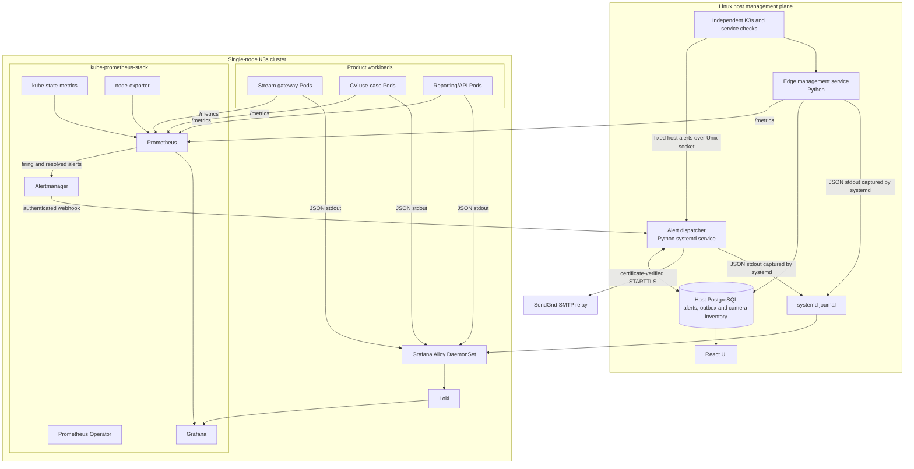

# TVT monitoring and error-reporting design

## 1. Purpose

This document defines monitoring and error reporting for the single-server TVT
video-analytics system described in `HLD.md`. The physical server runs one K3s
server/worker node, a host edge-management service, and five to eight cameras.
Stream ingestion and CV inference run in K3s Pods.

The design makes three deliberate choices:

1. Python services use `prometheus_client` directly, and the Prometheus server
   installed by `kube-prometheus-stack` scrapes their metrics.
2. Services emit single-line structured JSON to stdout. Grafana Alloy collects
   the resulting container and host logs and sends them to Loki.
3. Distributed tracing is not deployed. A request or operation ID is propagated
   through HTTP headers, job payloads, and explicit function boundaries and is
   included in structured logs.
4. A host `tvt-alert-dispatcher.service` durably records Alertmanager and host
   alerts, applies acknowledgement-aware email policy, and delivers through
   SendGrid SMTP independently of K3s.

This is a proportionate first version for two or three services with linear
request flows. Metrics are the primary alert source; logs supply diagnostic
detail.

## 2. Grafana Alloy deployment constraints

Grafana Alloy is the supported collector for this design. It runs only the log
collection components needed to discover local sources, process entries, and
write them to Loki; Alloy's optional metrics and tracing pipelines are not
enabled.

The deployment must:

- pin the Alloy Helm chart and container image to tested versions and mirror
  the image into the controlled local registry;
- run one Alloy DaemonSet Pod on each K3s node (one Pod in this deployment);
- mount CRI Pod-log and systemd-journal paths read-only;
- grant only the Kubernetes discovery and Events permissions used by the
  configured components;
- persist Alloy's per-node `--storage.path` so file offsets and journal cursors
  survive ordinary Pod restarts; and
- set explicit CPU, memory, batch, queue, and retry controls.

The logging contract remains independent of the collector: applications write
single-line JSON to stdout and the node collector forwards it to Loki.

See the official
[Grafana Alloy deployment documentation](https://grafana.com/docs/alloy/latest/set-up/deploy/).

## 3. Goals

- Show server, K3s, camera, stream, and inference health.
- Detect actionable failures within a few minutes.
- Preserve enough context to diagnose common failures without opening a shell
  on the server.
- Display firing and resolved alerts in the host React UI.
- Durably queue, retry, and audit operational alert email.
- Support multiple Python worker processes inside a Pod.
- Correlate logs across the small number of services without deploying a trace
  backend.
- Keep credentials, faces, number plates, and other sensitive data out of
  monitoring telemetry.
- Keep the application instrumentation independent of the dashboard product.

## 4. Non-goals

- Distributed tracing, span collection, or a trace backend.
- Per-frame traces or per-frame logs.
- Exact storage of attendance, face, ANPR, or vehicle events in Prometheus or
  Loki.
- Video, image, or diagnostic-snapshot storage in Loki.
- SMS, paging, and notification channels other than the approved SendGrid SMTP
  relay.
- Monitoring that survives a complete power, disk, kernel, or server failure.
- High availability for Prometheus, Alertmanager, Grafana, Loki, or Alloy.
- Off-site remote shell access or Tailscale in V1.

## 5. Monitoring architecture



The word Prometheus is used in two different ways:

- `prometheus_client` is a Python library inside an application process. It
  creates current metric values and exposes them through `/metrics`.
- Prometheus in `kube-prometheus-stack` is the server that discovers targets,
  scrapes `/metrics`, stores time series, evaluates rules, and sends alerts to
  Alertmanager.

The two are complementary. `kube-prometheus-stack` does not automatically know
about frames, cameras, models, or inference errors; those metrics must be
instrumented in the product services.

## 6. kube-prometheus-stack

The stack is installed into a dedicated `monitoring` namespace using a pinned
Helm chart and pinned container-image digests. The Helm chart creates multiple
Kubernetes workloads rather than one monitoring Pod:

| Component | Typical workload | Responsibility |
|---|---|---|
| Prometheus Operator | Deployment | Reconcile monitoring custom resources |
| Prometheus | StatefulSet | Scrape/store metrics and evaluate rules |
| Alertmanager | StatefulSet | Group, inhibit, silence, and route alerts |
| Grafana | Deployment | Administrative dashboards and investigation |
| kube-state-metrics | Deployment | Expose Kubernetes object state |
| node-exporter | DaemonSet | Expose Linux host metrics |

Only one replica of each stateful monitoring component is used. Multiple
replicas on the same physical server do not protect against host failure and
consume resources needed by CV workloads.

The chart values must be validated against K3s instead of accepted unchanged:

- disable etcd targets and rules when the single server uses K3s's default
  SQLite datastore;
- disable or reconfigure scheduler, controller-manager, and proxy targets that
  K3s does not expose in the form expected by the chart;
- set explicit CPU and memory requests/limits;
- set explicit metric-retention time and storage-size limits; and
- restrict Prometheus, Alertmanager, Loki, Grafana, and Alloy HTTP endpoints to
  the host or management network rather than exposing them publicly.

The official chart documentation is at
[kube-prometheus-stack](https://github.com/prometheus-community/helm-charts/tree/main/charts/kube-prometheus-stack).

## 7. Python metric instrumentation

### 7.1 Metric types

Use the following `prometheus_client` instruments:

| Type | Use | Examples |
|---|---|---|
| Counter | Events that only accumulate | Frames processed, inference errors, reconnects |
| Gauge | Current value or state | Queue depth, active consumers, stream up/down |
| Histogram | Distribution of observations | RTSP validation and inference duration |

Do not use Prometheus as the authoritative record for attendance, face
recognition, ANPR, or report results. A scrape-based time-series system does not
provide exact business-event retention.

### 7.2 Required product metrics

Host camera discovery and validation:

```text
edge_camera_discovered{camera_id}
edge_camera_rtsp_valid{camera_id}
edge_camera_last_seen_timestamp_seconds{camera_id}
edge_camera_validation_failures_total{camera_id,reason}
edge_camera_validation_duration_seconds{camera_id}
edge_camera_sync_pending{camera_id}
```

Stream gateway:

```text
stream_up{camera_id}
stream_last_media_timestamp_seconds{camera_id}
stream_upstream_bitrate_bytes_per_second{camera_id}
stream_reconnects_total{camera_id,reason}
stream_packets_received_total{camera_id}
stream_packets_dropped_total{camera_id,reason}
stream_consumer_count{camera_id}
```

CV inference:

```text
cv_frames_received_total{camera_id,use_case}
cv_frames_processed_total{camera_id,use_case}
cv_frames_dropped_total{camera_id,use_case,reason}
cv_inference_attempts_total{camera_id,use_case}
cv_inference_errors_total{camera_id,use_case,reason}
cv_inference_duration_seconds{use_case}
cv_queue_depth{use_case}
cv_last_success_timestamp_seconds{camera_id,use_case}
cv_model_ready{use_case,model_version}
```

HTTP/API services:

```text
http_requests_total{service,method,route,status_class}
http_request_duration_seconds{service,method,route}
http_requests_in_progress{service}
application_errors_total{service,error_code}
```

Host alert dispatcher:

```text
tvt_alert_events_total{source,status,result}
tvt_alerts_active{severity}
tvt_notification_outbox_depth{state}
tvt_notification_oldest_pending_age_seconds
tvt_notification_delivery_attempts_total{result}
tvt_notification_delivery_duration_seconds{result}
tvt_notification_last_success_timestamp_seconds
tvt_alert_emergency_spool_items
```

Use normalized route templates such as `/cameras/{camera_id}`, not raw request
paths containing IDs.

### 7.3 Label policy

Permitted labels have small, controlled value sets:

- stable internal `camera_id` for the five to eight cameras;
- `use_case` from a fixed use-case list;
- `reason` or `error_code` from a documented error taxonomy;
- normalized HTTP method, route, and status class; and
- deployment/build version when it changes infrequently.

Never use these as Prometheus labels:

- request or operation ID;
- frame, event, face, or vehicle ID;
- person name or number plate;
- camera IP address or RTSP URL;
- username, password, token, or Secret;
- full exception message or stack trace; or
- timestamp.

### 7.4 Multiprocess mode

Each Pod may contain multiple Python worker processes. The default
`prometheus_client` in-memory registry is not correct in this arrangement
because a scrape may reach only one worker's metric state. Every multiworker
service must use the client's multiprocess mode.

Set the shared directory before Python starts:

```text
PROMETHEUS_MULTIPROC_DIR=/run/prometheus-multiproc
```

The directory must be writable by the application user, shared by all workers,
and emptied before each new master process starts. It must not be cleared from
application import code. A Pod `emptyDir` volume may provide the path, but the
container entrypoint must still clear it whenever a new process-manager master
starts because `emptyDir` survives a container restart within the same Pod.

The metrics endpoint uses a clean registry containing the multiprocess
collector:

```python
from prometheus_client import CollectorRegistry, generate_latest, multiprocess


def render_metrics() -> bytes:
    registry = CollectorRegistry()
    multiprocess.MultiProcessCollector(registry)
    return generate_latest(registry)
```

Do not also register application metrics into this scrape registry; doing so
can expose duplicate metric families.

For Gunicorn, configure worker cleanup:

```python
from prometheus_client import multiprocess


def child_exit(server, worker):
    multiprocess.mark_process_dead(worker.pid)
```

The equivalent lifecycle hook is required for any other process manager. A
process manager without a reliable worker-exit hook increases the risk of stale
Gauge data.

Counters and Histograms aggregate naturally. Every Gauge requires an explicit
multiprocess meaning:

| Gauge | Suggested mode | Meaning |
|---|---|---|
| HTTP requests in progress | `livesum` | Total across living workers |
| Total worker queue depth | `livesum` | Combined queued work |
| Worst worker queue depth | `livemax` | Maximum among living workers |
| Any worker has a model ready | `livemax` | At least one worker is ready |
| All workers have a model ready | `livemin` | Every worker is ready |

Avoid `liveall` unless a per-worker series is operationally necessary; its PID
dimension causes time-series churn as workers restart.

Multiprocess mode does not support normal custom collectors, `Info`, `Enum`,
Gauge `set_function`, exemplars, Pushgateway, or removing/clearing label values.
Kubelet/cAdvisor supplies Pod-level CPU and memory metrics instead of relying on
Python process collectors.

See the official
[`prometheus_client` multiprocess documentation](https://prometheus.github.io/client_python/multiprocess/).

### 7.5 Error instrumentation rule

Every actionable application error performs both actions:

1. Increment a bounded Prometheus error counter.
2. Emit one structured JSON error log with diagnostic context and stack trace
   where appropriate.

Prometheus detects frequency and duration; Loki provides the detailed cause.

## 8. Prometheus target discovery

Every instrumented workload declares a named metrics port and a Kubernetes
Service. A `ServiceMonitor` or `PodMonitor` selects it and specifies the scrape
path and interval.

```text
Python workers
  -> aggregate /metrics for their Pod
  -> Kubernetes Service/EndpointSlice
  -> ServiceMonitor
  -> Prometheus Operator
  -> Prometheus scrape
```

Prometheus must scrape individual Pod endpoints discovered through the Service,
not the Service cluster IP as one load-balanced target. This preserves one
time-series instance per Pod. PromQL performs cross-Pod aggregation when
needed.

ServiceMonitor labels and namespace selectors must match the selectors in the
Prometheus custom resource installed by the Helm release. A target is not
considered integrated until it appears as healthy in Prometheus's Targets view.

The host edge-management and alert-dispatcher services run outside K3s. Each
exposes a protected metrics endpoint on a host address reachable from the
Prometheus Pod and is added with a narrowly scoped `ScrapeConfig` or equivalent
static target. The endpoints are accessible only from the local Pod/management
network.

## 9. Alert rules

Use `PrometheusRule` resources for standard cluster rules and TVT-specific
rules. Alerts represent actionable symptoms and include a `for` duration to
avoid transient camera reconnects or normal rolling updates.

Initial product alerts:

| Alert | Initial condition | Initial delay |
|---|---|---|
| `CameraRTSPInvalid` | Enabled camera fails authenticated RTSP validation | 2 minutes |
| `CameraMediaMissing` | Last upstream media timestamp is stale | 2 minutes |
| `CameraReconnectStorm` | Reconnect count exceeds the allowed window | 5 minutes |
| `StreamGatewayUnavailable` | Gateway has no available replica | 2 minutes |
| `CVWorkloadUnavailable` | Desired CV Deployment has no available replica | 2 minutes |
| `CVNoSuccessfulInference` | Media flows but inference success timestamp is stale | Use-case specific |
| `CVHighErrorRate` | Error/attempt rate exceeds its threshold | 5 minutes |
| `CVDroppingFrames` | Sustained dropped-frame ratio exceeds threshold | 5 minutes |
| `CVQueueBacklog` | Queue remains above its capacity threshold | 5 minutes |
| `CameraConfigSyncPending` | Valid camera configuration cannot be applied to K3s | 2 minutes |

Standard stack alerts cover:

- Node not Ready;
- Pod crash loops and unavailable Deployments;
- OOM-killed containers;
- CPU and memory saturation;
- disk-space and inode exhaustion;
- Kubernetes API health; and
- Prometheus, Alertmanager, and Operator failures.

Thresholds in this document are starting values, not final SLOs. Tune them with
camera-disconnect, Pod-failure, load, and reboot measurements.

## 10. Durable alert delivery and host UI state

Alertmanager uses an authenticated webhook receiver exposed by the separate
host alert-dispatcher service:

```text
PrometheusRule
  -> Prometheus evaluates firing/resolved state
  -> Alertmanager groups and deduplicates
  -> dispatcher webhook receives firing/resolved notification
  -> one PostgreSQL transaction stores the transition and outbox item
  -> dispatcher worker retries SendGrid SMTP delivery independently
  -> React UI displays alert, acknowledgement, and redacted delivery state
```

Enable resolved notifications. Use stable alert labels such as `alertname`,
`severity`, `service`, `camera_id`, and `use_case` to deduplicate records.
Descriptions and runbook links belong in annotations.

The webhook endpoint binds only to the host address reachable from the Pod
network, uses a dedicated rotated bearer credential, validates content type,
schema, timestamp, payload size, alert count, bounded fields, and allowed label
values, and accepts no command, template, recipient, or shell input. UI
acknowledgement is a local operator state; it does not silence Alertmanager.

The transition idempotency key includes source, stable fingerprint, occurrence
start time, transition status, and resolution time. Duplicate or retried
webhooks update last-seen state without creating duplicate transition emails.
Alertmanager owns grouping, inhibition, deduplication, and initial notification
timing. The dispatcher owns acknowledgement-aware reminders, recovery-email
eligibility, retry, expiry, and delivery audit.

Host/control-plane checks enter through a permission-restricted Unix socket so
K3s, Prometheus, or Alertmanager failure can still produce an alert. When
PostgreSQL is unavailable, only allowlisted host-infrastructure alert types may
enter a bounded, atomically written emergency filesystem spool. Normal
Alertmanager webhook delivery receives a retryable failure instead of falling
back to that spool.

### 10.1 Initial notification policy

| Severity | Alert timing | Email behavior |
|---|---|---|
| `critical` | Usually require 2 minutes; Alertmanager `group_wait` 30 seconds | Send after grouping; repeat every 30 minutes while active and unacknowledged |
| `warning` | Usually require 5-10 minutes; group for 5 minutes | Send once; repeat every 4 hours while active and unacknowledged |
| `info` | Record and display | No immediate email |

Acknowledgement stops future reminders but does not clear an alert or suppress
its recovery email. A recovery email is generated only if a firing email for
the same occurrence was successfully delivered. Root-cause inhibition covers
Node/K3s-down, gateway-down, camera-offline, and PostgreSQL-down cascades.

### 10.2 SendGrid SMTP and outbox policy

SendGrid SMTP is the V1 relay. The dispatcher connects to
`smtp.sendgrid.net:587` with certificate-verified STARTTLS, SMTP username
`apikey`, and a restricted SendGrid API key loaded from a protected host
credential file. It never permits plaintext fallback.
The documentation defaults are `tvt-alerts@tvt.example` and
`tvt-test-operator@tvt.example`; installation must replace them with a
SendGrid-verified sender and reachable test recipient.

Retries use approximately 1, 2, 5, 10, and 30 minutes, then hourly until the
notification is 24 hours old. Permanent SMTP failures are retained as failed;
transient failures are retried. Delivery is at-least-once, so an ambiguous
network failure after SMTP acceptance may produce a duplicate. A deterministic
`Message-ID` and thread key make that behavior visible and groupable.

Alert email is limited to site, severity, alert name, component, stable camera
ID, safe summary, start time, duration, state, and approved dashboard/runbook
links. It must not contain camera credentials, direct RTSP URLs, faces,
embeddings, people, plates, Kubernetes Secret values, raw logs, or stack traces.
The dispatcher is not the automated daily business-report mailer.

## 11. Structured JSON logging

### 11.1 Output contract

Every service writes one complete JSON object per stdout line. Kubernetes
captures Pod stdout in CRI log files; Alloy tails those files. For the host edge
and alert-dispatcher services, systemd captures stdout in journald and Alloy
reads the journal through an explicitly mounted, read-only host path.

Required fields:

```json
{
  "timestamp": "2026-08-28T12:10:00.123Z",
  "level": "error",
  "service": "stream-gateway",
  "event": "rtsp_connection_failed",
  "error_code": "RTSP_AUTH_FAILED",
  "message": "RTSP authentication failed",
  "camera_id": "camera-03",
  "use_case": null,
  "request_id": "c86ce151-6779-4ce3-985a-e59662532660",
  "stream_session_id": "d2f7c3d5-8c41-4201-904b-9ed525e527c2",
  "retry_in_seconds": 30
}
```

The logger may add exception type and stack trace as escaped JSON string fields.
It must not emit a multi-line non-JSON traceback as a separate event.

Use stable `event` and `error_code` values. Human-readable `message` text may
change and is not an alert key.

### 11.2 Grafana Alloy collection and processing

Alloy runs as one DaemonSet Pod on the single K3s node and collects:

- product Pod logs;
- monitoring-component Pod logs;
- Kubernetes Events where configured;
- K3s/containerd host logs required for operations; and
- edge-management and alert-dispatcher service journald entries.

The Alloy pipeline uses Kubernetes discovery and relabeling to select local Pod
log files. `loki.source.file` tails them, `loki.source.journal` reads the mounted
systemd journal, and `loki.source.kubernetes_events` collects Events when that
source is enabled. `loki.process` parses the CRI wrapper and JSON payload and
applies the label policy; `loki.write` sends the resulting entries to Loki.

Only low-cardinality Kubernetes metadata and parsed fields become Loki labels:

```text
cluster
namespace
service
container
level
```

Do not promote `request_id`, session ID, camera IP, stack trace, message, or
timestamp to Loki labels. Query them from parsed JSON:

```logql
{service="stream-gateway"} | json | request_id="c86ce151-6779-4ce3-985a-e59662532660"
```

`camera_id` may remain structured metadata rather than an indexed label. With
only five to eight stable cameras it is technically bounded, but keeping it out
of the base label set makes the schema safer if the deployment grows.

Alloy's `--storage.path` must use persistent per-node storage. Components keep
their read positions there so an ordinary Alloy restart does not re-ingest all
available log files. Read-only host mounts and least-privilege RBAC restrict
Alloy to the log sources and Kubernetes metadata it requires. The DaemonSet
must expose Alloy's health and internal metrics to Prometheus so stalled reads,
parse failures, and failed Loki writes are observable.

### 11.3 Sensitive-data policy

Logs must never contain:

- camera usernames, passwords, or credential-bearing RTSP URLs;
- Kubernetes tokens or Secret values;
- face images, embeddings, or personally identifying face metadata;
- raw number plates unless explicitly authorized by a separate data policy;
- email credentials; or
- arbitrary HTTP request/response bodies.

Redaction occurs in the application before stdout. Alloy processing is a
secondary safeguard, not the primary secret-control boundary.

## 12. Loki

Loki runs in K3s as a single-server deployment suitable for the expected log
volume. Grafana uses it as a data source for investigation.

Define explicit retention and size limits before production deployment. Loki
stores operational logs only; it does not store frames or application business
records. If storage is ephemeral, Pod replacement removes diagnostic history.
If a local PVC is enabled, it improves post-incident investigation but does not
protect against physical disk failure.

Primary alerts come from Prometheus metrics. Loki-derived alerting is reserved
for a failure that cannot reasonably be represented by a bounded application
metric. Error handling should normally increment a metric and emit a log in the
same code path.

## 13. Request and operation correlation

Distributed tracing is intentionally omitted. Correlation uses IDs in logs.

### 13.1 HTTP convention

For every incoming HTTP request:

1. Accept `X-Request-ID` only if it satisfies a strict length and character
   policy; otherwise generate a UUID.
2. Bind the ID to the current Python execution context.
3. Include it automatically in every log emitted for that request.
4. Forward it in downstream HTTP requests.
5. Return it in the HTTP response header.

Python middleware and `contextvars` should perform automatic log enrichment.
Passing the ID as a normal function argument is reserved for explicit domain or
job boundaries, rather than adding it to every internal function signature.

### 13.2 Non-HTTP operations

Use an `operation_id` for camera discovery/onboarding and report generation, an
`event_id` for an asynchronous application event, and a `stream_session_id` for
one upstream RTSP connection lifetime. Propagate the appropriate ID in job or
event payloads.

These IDs belong in logs, not Prometheus labels.

### 13.3 Accepted limitations

Request IDs provide search correlation but do not provide:

- parent/child spans;
- an automatic service dependency graph;
- exact time spent in each downstream call;
- automatic context propagation; or
- critical-path analysis for fan-out.

Reconsider distributed tracing if the system grows beyond a few services,
introduces asynchronous queues or complex request fan-out, calls remote APIs on
the critical path, or repeatedly requires manual reconstruction of latency.

## 14. Dashboards

Grafana is the administrator/debugging UI. The host React UI remains the normal
operator UI and displays summarized health and alerts.

Initial Grafana dashboards:

1. **Server overview:** CPU, memory, filesystem, disk I/O, network, temperature,
   Node status, and monitoring-stack health.
2. **Camera overview:** discovered/enabled cameras, RTSP status, last media age,
   reconnect rate, and bitrate.
3. **Stream gateway:** packets, drops, consumers, reconnects, and Pod resources.
4. **CV workloads:** input/processed FPS, error rate, latency percentiles, queue
   depth, frame drops, model readiness, Pod restarts, and GPU metrics when a
   vendor exporter is added.
5. **Error investigation:** alert state, error-code rates, and links to Loki
   queries constrained by service, camera, use case, and alert time window.

Dashboard variables must use bounded dimensions. Do not build variables from
request IDs, frame IDs, people, or plates.

## 15. Deferred remote access

Off-site remote access is not installed, configured, or accepted in V1. The
management UI is available only from the on-site management network. An on-site
console or separately approved local support path is required for diagnostics
that cannot be completed through the UI, metrics, and logs.

The remainder of this section records a possible later design and is
non-normative until separately approved. Remote access would remain a
last-resort diagnostic path and would not substitute for an external heartbeat
or off-box telemetry.

If later approved, the candidate remote-access gateway is **Tailscale plus
Tailscale SSH**:

```text
managed engineer device
  -> Tailscale identity and network policy
  -> encrypted tailnet connection
  -> Tailscale SSH authorization and reauthentication
  -> non-root support account
  -> explicitly authorized diagnostic or escalation actions
```

In that future design, `tailscaled` would run as a host `systemd` service
independently of K3s and provide both private network reachability and the
Tailscale SSH server. It would preserve access when the Kubernetes API, cluster
networking, or all Pods are unavailable, without exposing SSH directly to the
public internet, and would map an authorized tailnet identity to an existing
non-root Linux account.

### 15.1 Why Tailscale SSH is the candidate

Tailscale SSH centralizes network admission and SSH authorization in the
tailnet policy. Engineers authenticate through the approved organization
identity provider instead of distributing persistent OpenSSH public keys to
every deployed edge server. Removing an engineer or changing the support group
updates access centrally rather than requiring an `authorized_keys` change on
each server.

SSH access uses Tailscale SSH `check` mode to require periodic identity-provider
reauthentication. The identity provider must enforce multifactor authentication;
SSO alone is not treated as MFA. The SSH policy maps only explicitly authorized
support identities to a named non-root local account. It does not use a broad
mapping that permits arbitrary non-root local usernames, and it does not permit
direct root login.

Tailscale SSH session recording is not enabled until a data policy defines its
purpose, access, retention, and deletion behavior because terminal output can
contain camera credentials, faces, number plates, tokens, or other sensitive
information.

### 15.2 Tailscale SSH vs OpenSSH

Tailscale plus normal OpenSSH would require two identity and credential
lifecycles: the organization identity used to enter the tailnet and separate
SSH keys or certificates authorized on the host. Onboarding, offboarding,
rotation, and recovery would have to keep both systems synchronized. Tailscale
SSH instead uses one organization identity for network and shell access while
still evaluating separate tailnet network and SSH authorization rules. The
single-identity model is simpler for this deployment; the Linux account and
`sudo` policy remain independent host-level controls.

### 15.3 Future host and tailnet controls

A future remote-access configuration would have to:

- use an organization-owned tailnet connected to the approved identity
  provider with multifactor authentication;
- enroll the edge server as a purpose-based tagged device rather than as a
  device owned by an individual engineer;
- use a one-time provisioning credential and remove it from the host and
  installation media after enrollment;
- grant only the support group and approved managed devices network access to
  TCP port 22 on tagged edge servers;
- define a separate Tailscale SSH rule that uses `check` mode and permits only
  the named support account on tagged edge servers;
- deny edge-to-engineer and edge-to-unrelated-tailnet connectivity unless a
  separately documented use case requires it;
- prohibit Tailscale SSH access as `root` and prohibit mappings to arbitrary
  non-root local accounts;
- rely on individually attributable identity-provider accounts rather than
  shared support identities, and define prompt user and device revocation
  procedures;
- place engineers in a non-root support account with read-only diagnostic
  access by default and separately controlled `sudo` escalation;
- configure Tailscale SSH to intercept port 22 only on the Tailscale address and
  expose no remote shell service directly on the public WAN; and
- collect Tailscale service state and SSH authorization events through journald
  and Alloy without logging credentials, command output, or transferred
  diagnostic data by default.

The future edge configuration would not use a Tailscale exit node or advertise
the camera LAN as a subnet route. Engineers would diagnose camera connectivity
from the edge server using bounded tools so remote access could not create a
general route from support devices into the camera network. Advertising
selected camera routes would require a separate threat review, customer
approval, and destination-specific access policy.

Prometheus, Alertmanager, Grafana, Loki, PostgreSQL, the Kubernetes API, and the
edge-management API would not be made generally reachable through the tailnet.
Direct inspection of a local administrative endpoint would use an explicitly
authorized, incident-scoped Tailscale SSH local port forward.

### 15.4 Availability boundaries

Tailscale remote access depends on the deployed site having a functioning WAN
path. If that internet path fails:

- `tailscaled` may continue running, but an off-site engineer cannot reach it;
- an on-site engineer needs a separately approved local management path or
  console; and
- a separate customer WAN, cellular management path, or hardware out-of-band
  controller is required if remote access during the primary WAN or host OS
  failure is an availability requirement.

Tailscale SSH also cannot recover a powered-off server, a failed kernel, a
stopped `tailscaled` process, or broken host networking. The external heartbeat
must report loss of the server independently; hardware out-of-band management
is a future deployment choice rather than part of this software tunnel.

### 15.5 Support workflow

For a future remote incident, the engineer would:

1. Reviews the central alert, dashboard, correlated logs, and available
   diagnostic snapshot before requesting shell access.
2. Records an incident or operation ID and the reason remote access is needed.
3. Connects from an approved, managed Tailscale device and authenticates again
   through Tailscale SSH `check` mode with an individual organization identity.
4. Uses read-only host, K3s, camera-connectivity, and log commands first.
5. Performs a privileged or state-changing action only through the documented
   escalation procedure and records the action against the incident.
6. Closes port forwards and the SSH session when diagnosis is complete.

The support runbook must include `tailscale status`, `tailscale ping`, and
`tailscale netcheck` so an engineer can distinguish direct, relayed, policy,
DNS, and site-WAN failures from a Tailscale SSH authorization failure.

## 16. Failure boundaries

| Failure | Observable by | Result |
|---|---|---|
| One Python worker fails | Process manager, application metrics/logs | Worker restarts; multiprocess dead-worker cleanup runs |
| Product Pod fails | Kubernetes and kube-prometheus-stack | Deployment replaces Pod; standard alert may fire |
| Prometheus fails | Host edge check and Kubernetes | Metric collection/alerts pause; host UI remains available |
| Alertmanager fails | Prometheus/Kubernetes and host stale-heartbeat check | In-cluster webhook delivery pauses; the host path alerts independently |
| Alert dispatcher fails | `systemd`, edge check, Alertmanager delivery failure | Dispatcher restarts; committed outbox work resumes and Alertmanager retries uncommitted webhooks |
| SendGrid/WAN fails | Dispatcher SMTP result | Email remains in the durable outbox and retries until delivered, failed permanently, or expired |
| PostgreSQL fails | Host checks and dispatcher | Normal alert persistence pauses; only allowlisted host alerts use the bounded emergency spool |
| Alloy fails | Kubernetes/Prometheus | Logs remain in CRI/journal subject to local retention; forwarding pauses |
| Loki fails | Kubernetes/Prometheus | Log queries/ingestion fail; metrics and alerts continue |
| K3s API/control plane fails | Host edge-management service | Host UI records cluster outage independently |
| Entire server fails | Nothing on the server | All local monitoring stops; external heartbeat is future work |

An in-cluster Prometheus cannot be the sole detector of total K3s failure. The
host edge-management service retains its independent systemd and API checks as
defined in `HLD.md`.

## 17. Retention and resource controls

Monitoring runs on the same server as inference and must not exhaust resources
needed by CV workloads.

Configure and verify:

- Prometheus retention time and maximum storage size;
- Loki retention and ingestion-rate limits;
- Alloy batch size, queue capacity, and retry limits;
- explicit requests and limits for every monitoring Pod;
- bounded histogram buckets and label sets;
- journald size and retention limits;
- alert-history retention in host PostgreSQL; and
- disk alerts that fire before either monitoring backend fills the server.

Initial V1 limits for the 1 TiB server are:

| Data | Retention/limit |
|---|---|
| Prometheus | 15 days and 20 GiB maximum |
| Loki | 7 days and 20 GiB maximum |
| Alloy on-disk queue/positions | 1 GiB maximum |
| systemd journal | 7 days and 2 GiB maximum |
| Camera observations | 30 days |
| Alert instances and transitions | 180 days after resolution |
| Notification attempts | 90 days |
| Audit events | 365 days |
| Emergency alert spool | 1,000 items or 100 MiB, whichever occurs first |

Disk alerts fire at 70%, 80%, and 90% usage. Monitoring ingestion is throttled
before it can consume capacity reserved for PostgreSQL, the local registry, or
CV workloads. These defaults can be lowered after field measurements; raising
them requires a storage-capacity review.

Camera inventory, alert/outbox/audit data, the local OCI registry, and retained
monitoring PVCs are included in the reinstall backup set. The installer writes
encrypted backups to an operator-provided external USB or approved network
share, verifies checksums, and requires a quarterly restore test. Video and
non-durable CV/business stub data are excluded. The UPS must signal the host OS
and provide enough runtime for an orderly PostgreSQL checkpoint, monitoring
shutdown, and filesystem sync.

## 18. Verification and acceptance criteria

The monitoring implementation is accepted when it demonstrates that:

1. Every instrumented service appears as an `UP` Prometheus target.
2. Prometheus scrapes one target per Pod rather than one load-balanced Service
   endpoint.
3. Metrics from all Python workers are included in one Pod scrape.
4. Repeated scrapes do not jump between worker-local counter values.
5. Killing a worker invokes dead-worker cleanup and removes stale live Gauges.
6. Restarting the process-manager master clears the multiprocess directory.
7. Counters, Histograms, and every Gauge aggregation mode have documented
   semantics and tests.
8. A simulated RTSP error increments the expected counter and produces one
   correlated JSON error log.
9. Alloy collects Pod stdout and host edge-service journal logs into Loki.
10. A request ID can be followed across all participating service logs.
11. Alertmanager sends firing and resolved notifications to the host webhook.
12. A sustained synthetic critical alert creates one firing email, records its
    SendGrid SMTP result, and creates one recovery email after resolution.
13. Duplicate and out-of-order webhooks do not create duplicate logical
    transitions or email jobs.
14. Acknowledgement stops reminder email without clearing the alert or
    suppressing recovery email.
15. SMTP failure retains the notification across dispatcher restart and sends
    it after recovery; PostgreSQL failure admits only allowlisted emergency
    host alerts to the bounded spool.
16. The React UI remains available and reports the outage when K3s or Prometheus
    is stopped.
17. Camera credentials, faces, plates, Secret values, and raw log bodies do not
    appear in `/metrics`, logs, Loki labels, alert payloads, dashboards, or
    email.
18. Restarting Alloy resumes from its persisted positions without replaying all
    locally retained logs, and position-loss behavior is documented and tested.
19. The public WAN cannot reach the management UI, monitoring endpoints,
    Kubernetes API, database, or a remote shell; the approved on-site
    management network can reach only its documented endpoints.

## 19. References

- `HLD.md` for system boundaries, host monitoring, recovery, and camera flow.
- `APEXFABRIC_ARCHITECTURE.md` for the underlying K3s, node reporting,
  scheduling, probe, and trust model.
- [`prometheus_client`](https://prometheus.github.io/client_python/) for Python
  metric instrumentation.
- [`prometheus_client` multiprocess mode](https://prometheus.github.io/client_python/multiprocess/)
  for worker aggregation and limitations.
- [kube-prometheus-stack](https://github.com/prometheus-community/helm-charts/tree/main/charts/kube-prometheus-stack)
  for the Prometheus Operator, Prometheus, Alertmanager, Grafana, and exporters.
- [Prometheus alerting practices](https://prometheus.io/docs/practices/alerting/)
  for actionable symptom-based alerts.
- [Twilio SendGrid SMTP integration](https://www.twilio.com/docs/sendgrid/for-developers/sending-email/integrating-with-the-smtp-api)
  for the relay host, port, API-key authentication, and sender setup.
- [Grafana Loki](https://grafana.com/docs/loki/latest/) for structured-log
  storage and querying.
- [Grafana Alloy Kubernetes deployment](https://grafana.com/docs/alloy/latest/configure/kubernetes/)
  for Helm-based collector configuration.
- [Grafana Alloy Loki components](https://grafana.com/docs/alloy/latest/reference/components/loki/)
  for file, journal, Kubernetes Event, processing, and write components.
- [Tailscale connection types](https://tailscale.com/docs/reference/connection-types)
  for direct, peer-relay, and DERP-relay connectivity behavior.
- [Tailscale firewall guidance](https://tailscale.com/docs/reference/faq/firewall-ports)
  for the outbound connectivity used by the host agent.
- [Tailscale SSH](https://tailscale.com/docs/features/tailscale-ssh) for SSH
  authorization, local-user mapping, and check-mode reauthentication.
